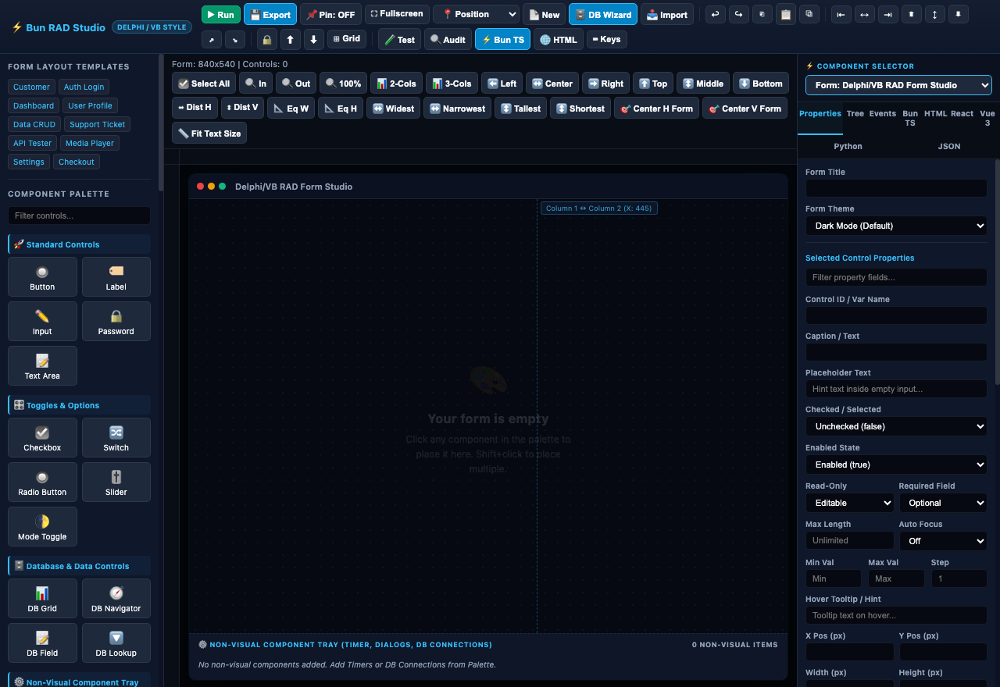
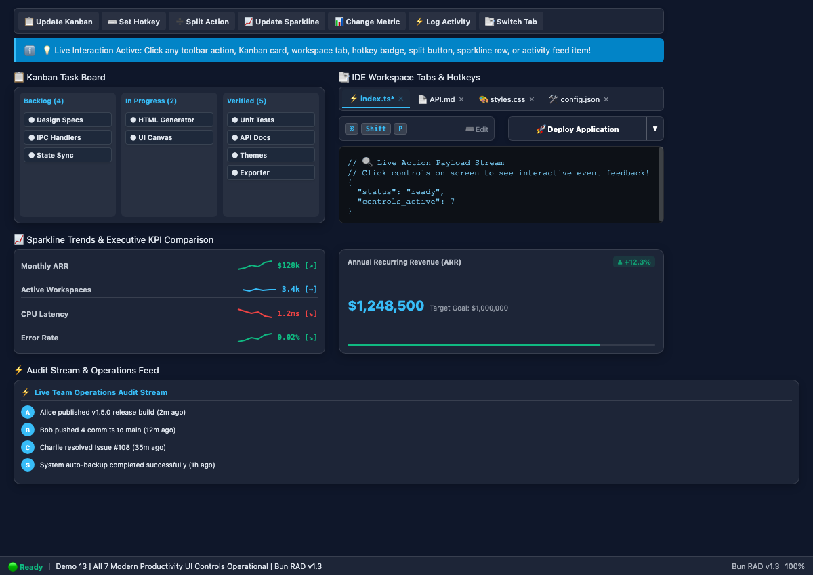

# ⚡ Bun RAD Studio (Delphi / Visual Basic Style IDE)

A high-performance Rapid Application Development (RAD) Visual IDE for **Bun** and **Webview-Bun**, inspired by classic Borland Delphi and Visual Basic 6, built with modern web technologies.




### ⚡ Modern Productivity UI Controls Studio (`demo:productivity`)


---

## 🌟 Highlights & Features

### 🚀 Visual RAD Form Designer
* **Interactive Canvas**: Drag, nudge, resize, and align components visually on a high-DPI scaled canvas with pixel rulers and smart grid snapping (8px, 16px, 4px, or off).
* **Delphi Anchors & Docking System**: Full support for component `Anchors` (`Top`, `Left`, `Right`, `Bottom`) and `Dock` modes (`None`, `Top`, `Bottom`, `Left`, `Right`, `Fill`) so forms dynamically reflow when resized.
* **Non-Visual Component Tray**: Visual bottom tray below the form canvas for non-visual RAD controls (`Timer`, `OpenFileDialog`, `SaveFileDialog`, `DBConnection`, `HTTPClient`, `Notification`) just like Borland Delphi and Lazarus.
* **Delphi Placement Mode**: Click any palette component to arm the placement crosshairs, then click anywhere on the canvas to place it at exact coordinates. Hold `Shift` while clicking to place multiple controls sequentially.
* **Marquee Multi-Selection**: Left-click and drag across the canvas background to marquee select groups of components.
* **Component Hierarchy & Tree**: View, filter, and select components in a real-time DOM hierarchy tree.

### 🖼️ Native Window Management & Placement API
* **Native Fullscreen Mode**: Press **<kbd>Cmd</kbd> + <kbd>F</kbd>** / **<kbd>Fn</kbd> + <kbd>F</kbd>** / **<kbd>F11</kbd>** or click `⛶ Fullscreen` to toggle borderless native macOS Cocoa window fullscreen mode (`[NSWindow toggleFullScreen:nil]`).
* **Stay On Top (Window Pinning)**: Click `📌 Pin: ON / OFF` or call `setAlwaysOnTop(true)` to float the application window above all other desktop applications (`NSFloatingWindowLevel`).
* **Window Placement API**: Position application windows anywhere on screen using `setWindowPosition(pos)` or the `📍 Position` toolbar dropdown across 9 screen presets (`"center"`, `"upper_left"`, `"upper_right"`, `"top_center"`, `"bottom_left"`, `"bottom_right"`, `"bottom_center"`, `"center_left"`, `"center_right"`) or exact `{ x, y }` coordinates.
* **Application Quit**: Press **<kbd>Cmd</kbd> + <kbd>Q</kbd>** (macOS) or **<kbd>Alt</kbd> + <kbd>F4</kbd>** / **<kbd>Ctrl</kbd> + <kbd>Q</kbd>** (Windows/Linux) to safely terminate application execution (`process.exit(0)`).

### 🗄️ MS Access & Delphi Data-Aware RAD Controls
* **Data-Aware Controls**: Access & Delphi style DB controls including `DBGrid` with sorting/paging, `DBNavigator` (First/Prev/Next/Last/Add/Delete/Post/Refresh), `DBInput`, and `DBDropdown` with live dataset field bindings.
* **1-Click Database CRUD Form Wizard**: Instant 1-click wizard button that auto-generates a complete, ready-to-run Customer Accounts Database CRUD layout.

### 🎨 70+ Modern UI & RAD Controls
* **Standard Controls**: Buttons, Labels, Single-Line Inputs, Password Inputs, Textareas, Checkboxes, Radio Buttons, Toggles/Switches, Sliders, Number Steppers, Color Wells, Date Pickers, and File Pickers.
* **Integrated Labeled Form Controls**: Form Field (`form_field`), Labeled Password (`form_password`), Labeled Textarea (`form_textarea`), Labeled Checkbox (`form_checkbox`), Labeled Radio (`form_radio`), Labeled Search Bar (`form_search`), Labeled Color Well (`form_color`), Labeled Time Picker (`form_time`), Labeled Stepper (`form_stepper`), Labeled Code Editor (`form_code`), Labeled File Drop Zone (`form_drop_zone`), Labeled Switch (`form_switch`), Labeled Slider (`form_slider`), Labeled Number (`form_number`), Labeled Date (`form_date`), Labeled Dropdown (`form_dropdown`), Labeled Link (`form_link`), and Labeled Progress (`form_progress`).
* **Desktop Application UI Controls**: Tab Container (`tabs`), Action Toolbar (`tool_bar`), Window Status Bar (`status_bar`), Split View Panel (`split_pane`), Pagination Bar (`pagination`), Command Palette Search (`command_palette`), Icon Toggle Button (`toggle_button`), Property Inspector Grid (`property_grid`), Popup Context Menu (`popup_menu`), Month Calendar View (`calendar_view`), Color Palette Swatch (`color_swatch`), File Path Location Bar (`file_path_bar`), Kanban Task Board (`kanban_board`), Keyboard Shortcut Recorder (`shortcut_recorder`), Split Action Button (`split_button`), Sparkline Data Table (`sparkline_table`), KPI Metric Comparison (`metric_comparison`), Activity Feed Stream (`activity_feed`), and Workspace Tab Bar (`file_tree_tabs`).
* **Advanced Modern Controls**: Segmented Control (`segmented_control`), Directory Tree Explorer (`tree_view`), Stacked User Profile Avatars (`avatar_group`), Executive KPI Stat Card with SVG Sparkline (`stat_chart`), Collapsible Accordion Panel (`accordion`), Step Navigation Breadcrumbs (`breadcrumb`), Step Activity Timeline (`timeline`), Floating Notification Toast Alert (`toast_card`), Precision Clock Time Picker (`time_picker`), and Searchable Combobox (`rich_select`).
* **Data & Non-Visual Controls**: DB Grid, DB Navigator, DB Field, DB Lookup, Timer, File Dialogs, DB Connection, REST HTTP Client, Notification.
* **Containers & Layout**: Group Box Panels, Data Tables, and Horizontal Dividers.
* **Form Presets & Templates**: Includes pre-built templates for Customer Registration, Auth Login, Executive Analytics Dashboard, User Profile, Data CRUD Manager, Help Desk Support Tickets, REST API Tester, Media Player, and E-Commerce Checkout.

### 🎨 macOS & Windows 11 Desktop Form Themes
* **macOS & Windows 11 Desktop Themes**: Comprehensive selection of modern desktop UI themes including **macOS Sonoma Dark**, **macOS Ventura Light**, **macOS Liquid Glass**, **Apple Dark (Space Gray)**, **Midnight Space Gray**, **Apple Sunset**, **Sonoma Emerald**, **Windows 11 Mica Light**, **Windows 11 Acrylic Dark**, **Windows 11 Fluent Slate**, **Windows 11 Sun Valley (Cobalt)**, Catppuccin, Dracula, Nord, Cyberpunk, Solarized, and High Contrast. Automatically harmonizes form canvas backgrounds, typography foregrounds, control surfaces, primary action button swatches, and container panels.

### 🛠️ High-Level Backend & Client Helper Utilities
Programmatically interact with and control form state from Bun TypeScript or client scripts:
- `getControlValue(id)` / `setControlText(id, text)` / `setControlValue(id, value)`
- `setControlEnabled(id, enabled)` / `setControlVisible(id, visible)`
- `setSegmentedSelected(id, text)` / `setStatChart(id, opts)` / `setToast(id, title, msg, alertType)`
- `setTimePickerValue(id, timeStr)` / `setAccordionOpen(id, open)` / `setTimelineSteps(id, stepsCSV)`
- `setBreadcrumbs(id, crumbsCSV)` / `setTreeNodes(id, nodesCSV)` / `setAvatarGroup(id, avatarsCSV)` / `setRichSelectText(id, text)`
- `setTabsActive(id, tabName)` / `setStatusBarText(id, text)` / `setPaginationPage(id, pageNum)` / `setToggleButtonState(id, active, labelText)`
- `setPropertyGridData(id, properties)` / `setPopupMenuItems(id, itemsCSV)` / `setCalendarDate(id, dateStr)` / `setColorSwatchColor(id, hex)` / `setFilePathBarPath(id, pathStr)`
- `setKanbanColumns(id, colsCSV)` / `setShortcutRecorderValue(id, shortcutStr)` / `setSplitButtonAction(id, text)` / `setSparklineTableData(id, rowsCSV)` / `setMetricComparison(id, title, val, target, change)` / `setActivityFeedItems(id, itemsCSV)` / `setWorkspaceTabs(id, filesCSV)`
- `setAlwaysOnTop(onTop)` / `setWindowPosition(pos)` / `quitApp()`

### ⚡ Auto-Generated Code & Multi-Target Exporters
* **Live Bun TypeScript Exporter**: Real-time auto-generated Bun + `webview-bun` TypeScript code (`index.ts`) complete with typed backend method bindings (`wv.bind(...)`).
* **React + Tailwind Exporter**: Export modern React TSX component code styled with Tailwind CSS.
* **Vue 3 SFC Exporter**: Export Vue 3 Single File Components (`.vue`) using `<script setup>`.
* **Python CustomTkinter Exporter**: Export standalone executable Python GUI desktop app code.
* **Standalone HTML5 Export**: Export clean, responsive HTML5 + CSS standalone web templates.
* **1-Click App Exporter**: Export a complete, runnable Bun project folder to disk (`/exported_project`).

---

## 💻 Installation & Quick Start

### Prerequisites
* [Bun Runtime](https://bun.com) (v1.0.0 or higher)
* macOS, Windows, or Linux with WebKit/Webview support

### 1. Clone & Install Dependencies
```bash
git clone https://github.com/codecaine-zz/bun_rad_studio.git
cd bun_rad_studio
bun install
```

### 2. Launch RAD Studio
```bash
bun run index.ts
```

### 3. Run Interactive Feature Demos
Explore pre-built executable demo applications demonstrating controls, events, and dynamic helper functions:

```bash
# Demo 1: Standard UI Controls, Events & Input Helpers
bun run demo:standard

# Demo 2: 10 Advanced Modern Controls & Helper Wrappers (Segmented, Stat Chart, Toast, Timeline, Tree View)
bun run demo:modern

# Demo 3: Data-Aware DB Grid, Non-Visual Timer (1000ms Event Ticks), & Code View
bun run demo:data

# Demo 4: Native Window Placement API (9 Screen Presets), Always On Top Pinning, & Fullscreen
bun run demo:window

# Demo 5: Dynamic Table Control Studio (Add/Remove Rows & Columns, Filtering, Sorting, Payroll Stats & IPC Log)
bun run demo:table

# Demo 6: Non-Visual Timer Control Studio (onTimer Tick Loops, Clock, Telemetry Gauges, Countdown & Speed Adjustment)
bun run demo:timer

# Demo 7: Labeled Form Controls & Desktop Application UI Controls Studio
bun run demo:desktop  # or: bun run demo:labeled

# Demo 8: Executive Analytics Dashboard Template (Metric KPI Cards, Stat Charts, Alert Banners)
bun run demo:dashboard

# Demo 9: Developer File Explorer & IDE Studio Template (Tree View, Workspace Tabs, Monospaced Code View)
bun run demo:ide

# Demo 10: Database Studio & Query Editor Template (DB Navigator, DB-bound Data Grids, SQL Code View)
bun run demo:db

# Demo 11: Desktop Application Settings & Preferences Template (Tabs, Toggles, Sliders, Time Pickers)
bun run demo:settings

# Demo 12: Additional 5 Desktop Application Controls Studio (Property Grid, Popup Menu, Calendar View, Color Swatch, File Path Bar)
bun run demo:app_controls

# Demo 13: Modern Productivity UI Controls Studio (Kanban Board, Hotkey Recorder, Split Button, Sparklines, Metric Comparison, Activity Audit Feed, Workspace Tabs)
bun run demo:productivity
```

---

## 📦 Compiling Standalone macOS Binaries (.app) with Custom Icons

To package your applications into standalone, distribution-ready macOS `.app` bundles with custom application icons, display names, and `Info.plist` metadata, leverage the companion project [bun_webview](https://github.com/codecaine-zz/bun_webview).

### Option 1: Native Single-File Executable
If you only need a standalone CLI binary without a macOS `.app` bundle structure or app icon:

```bash
bun build --compile index.ts
```

### Option 2: Full macOS `.app` Bundle with Custom Icons
To package your project into a complete macOS `.app` application bundle using [bun_webview](https://github.com/codecaine-zz/bun_webview):

1. **Clone the `bun_webview` builder repository**:
   ```bash
   git clone https://github.com/codecaine-zz/bun_webview.git
   cd bun_webview
   bun install
   ```

2. **Package your RAD application**:
   ```bash
   bun run build-app /path/to/your/index.ts --name "My Application" --icon /path/to/icon.png --identifier "com.example.myapp"
   ```

#### CLI Options:
* `-i, --icon <path>`: Path to a PNG icon (defaults to `resources/icon.png` or pre-built Apple-style glassmorphism icon templates).
* `-n, --name <name>`: Custom display name for the `.app` bundle (e.g. `--name "Customer Studio"`).
* `-d, --identifier <id>`: `CFBundleIdentifier` (e.g. `--identifier "com.company.app"`).
* `-v, --version <version>`: App version string (defaults to `package.json` version or `1.0.0`).
* `-o, --out <dir>`: Output directory for the `.app` bundle (defaults to `dist`).

#### Launching the Compiled App:
Launch your compiled `.app` bundle from macOS Finder in `dist/` or via terminal:
```bash

---

## 🎨 Declarative SimpleGUI Module (`simplegui`)

Build native desktop GUIs directly in TypeScript using an intuitive, fluent, event-driven API inspired by [vlang_simplegui](https://github.com/codecaine-zz/vlang_simplegui) — no visual designer required! For complete API docs, see the dedicated [SIMPLEGUI_API.md](file:///Users/codecaine/bun_rad_studio/SIMPLEGUI_API.md) reference.

```typescript
import { simplegui } from "bun_rad_studio";

// 1. Create a SimpleGUI window
const win = simplegui.createWindow("My SimpleGUI App", 760, 520, {
    theme: "apple_dark"
});

// 2. Add controls with fluent method chaining
win.addLabel("👤 User Account & Profile Setup")
   .font(20, "#38bdf8", "700");

win.beginCard("Personal Details");

win.beginRow();
win.addLabel("Full Name:").width(120);
win.addTextInput("e.g. Alex Mercer").id("txtName").width(260);
win.endRow();

win.beginRow();
win.addLabel("Plan:").width(120);
win.addDropdown(["Developer (Free)", "Pro ($19/mo)", "Enterprise ($99/mo)"], "Pro").id("cmbPlan").width(260);
win.endRow();

win.endCard();

// 3. Add interactive button with event callback & dialog prompt
win.addButton("🚀 Submit Profile", (w) => {
    const vals = w.getFormValues();
    w.showAlert(`✅ Profile created for ${vals.txtName || "User"} (${vals.cmbPlan})!`);
}).bg("#0284c7").color("#ffffff").bold().width(180).height(40);

// 4. Launch window
win.run();
```

### Key Features:
* **`vlang_simplegui` API Parity**: 100% API compatibility with `vlang_simplegui` (`new_simple_window()`, `add_input()`, `add_button()`, `hasControl()`, `listControls()`, `requireControl()`, `listThemes()`, `getTheme()`, `homeDir()`, `tempDir()`, `desktopDir()`, `documentsDir()`, `downloadsDir()`).
* **Multi-Window & Application Lifecycle**: Distinct `win.close()` / `win.close_window()` (closes current window handle without terminating process for multi-window support) and `win.exit()` / `win.quit()` / `win.exitApp()` / `win.quit_application()` (terminates process via `process.exit(code)`).
* **Fluent Method Chaining**: Chain styling & behavior modifiers (`.width()`, `.height()`, `.bg()`, `.color()`, `.bold()`, `.align()`, `.tooltip()`, `.onClick()`, `.onChange()`).
* **Form & Labeled Helpers**: `addFormField()`, `addFormPassword()`, `addFormDropdown()`, `addFormDatePicker()`, `addFormSwitch()`, `addFormSlider()`, `addFormNumber()`, `addHeading()`.
* **Typed Value Accessors**: `getText(id)`, `setText(id, val)`, `getBool(id)`, `setBool(id, val)`, `getInt(id)`, `setInt(id, val)`, `getFloat(id)`, `setFloat(id, val)`.
* **Auto-Reflowing Layout Containers**: `beginRow()` / `endRow()`, `beginGrid(cols)`, `endGrid()`, `beginCard(title)`, `endCard()`, `beginFlex()`, `endFlex()`.
* **Form Value Serialization**: `win.getFormValues()`, `win.setFormValues()`, `win.getValue(id)`, `win.setValue(id, val)`.
* **Native Dialogs & OS APIs**: `showAlert()`, `showConfirm()`, `showPrompt()`, `copyToClipboard()`, `setAlwaysOnTop()`, `toggleFullscreen()`.
* **Non-Visual Timer Loop**: `win.addTimer(intervalMs, onTick)`.
* **Demos**: `bun run demo:simplegui` or `bun run demo:simplegui_all`.

---

## ⌨️ Keyboard Shortcuts & Power Actions

| Shortcut | Action |
| --- | --- |
| **F5** | Launch Live App Preview Window |
| **⌘ + F** / **Fn + F** / **F11** | Toggle Native Borderless Fullscreen Mode |
| **⌘ + Q** / **Alt + F4** | Terminate & Quit Application (`process.exit(0)`) |
| **⌘ + C** / **Ctrl + C** | Copy selected control(s) to clipboard buffer |
| **⌘ + V** / **Ctrl + V** | Paste copied control(s) at cursor position |
| **⌘ + D** / **Ctrl + D** | Duplicate selected control(s) |
| **⌘ + A** / **Ctrl + A** | Select all controls on canvas |
| **⌘ + Z** / **Ctrl + Z** | Undo action |
| **⌘ + Shift + Z** | Redo action |
| **Delete** / **Backspace** | Delete selected control(s) |
| **Arrow Keys** | Nudge selected control(s) position by 1px |
| **Shift + Arrow Keys** | Nudge selected control(s) position by 8px (Grid snap) |
| **Space + Mouse Drag** | Pan canvas workspace view |
| **Cmd / Ctrl + Mouse Wheel** | Zoom canvas workspace (50% – 200%) |
| **Escape** | Deselect controls / Cancel placement mode / Close modals |

---

## 📂 Project Structure

```
bun_rad_studio/
├── index.ts          # Main Bun entry point, FFI Window Manager & Webview IPC runner
├── package.json      # Dependencies (webview-bun, @types/bun)
├── tsconfig.json     # TypeScript compiler settings
├── API.md            # Complete API & FormSpec JSON Schema Specification
├── README.md         # Documentation & User Guide
└── src/
    └── ide.html      # Complete RAD Designer Studio HTML5/CSS3/JS Application
```

---

## 📄 License

MIT License © Codecaine
