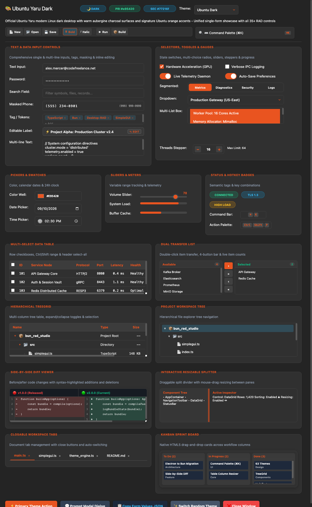
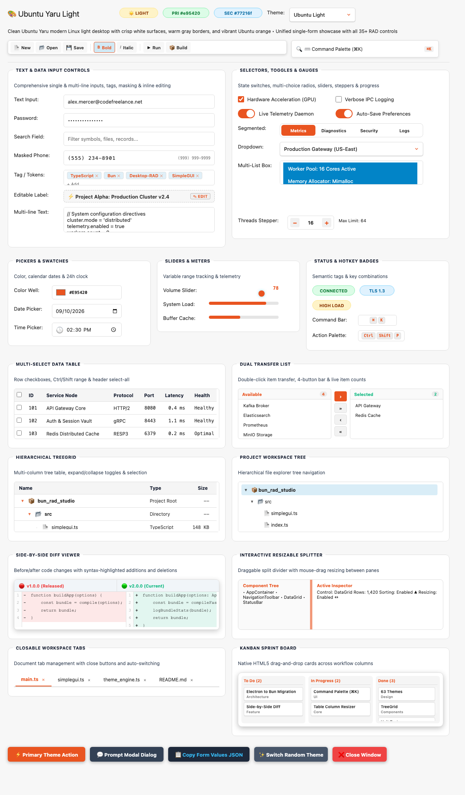
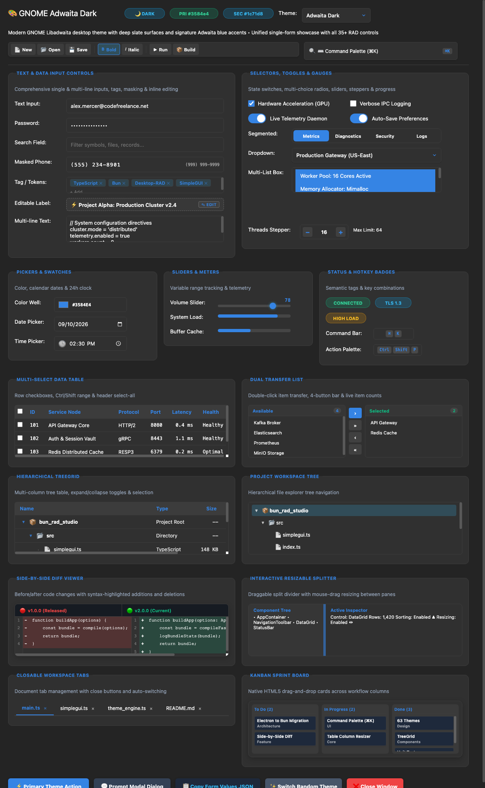
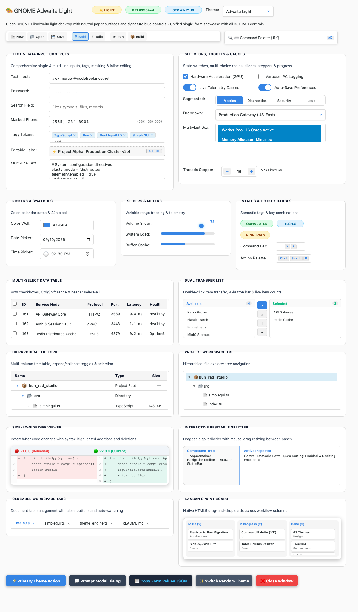
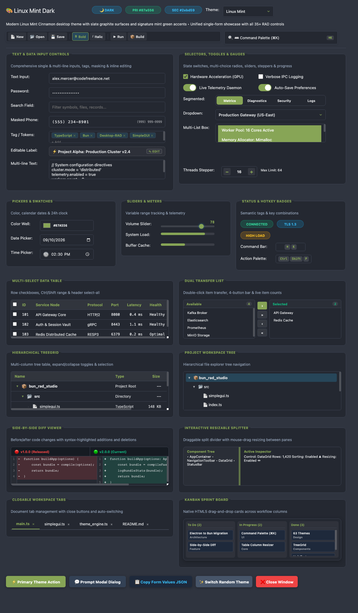
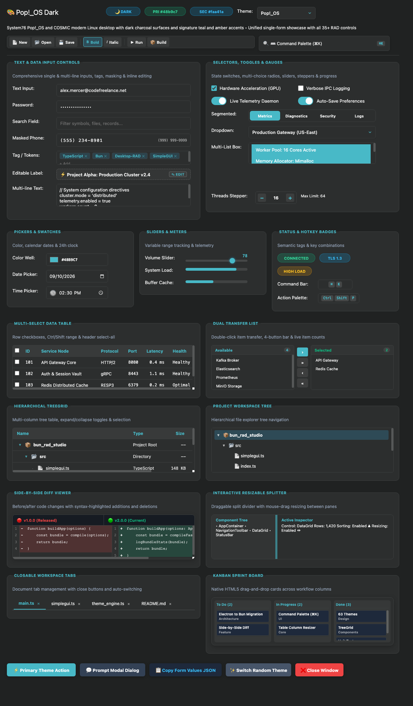
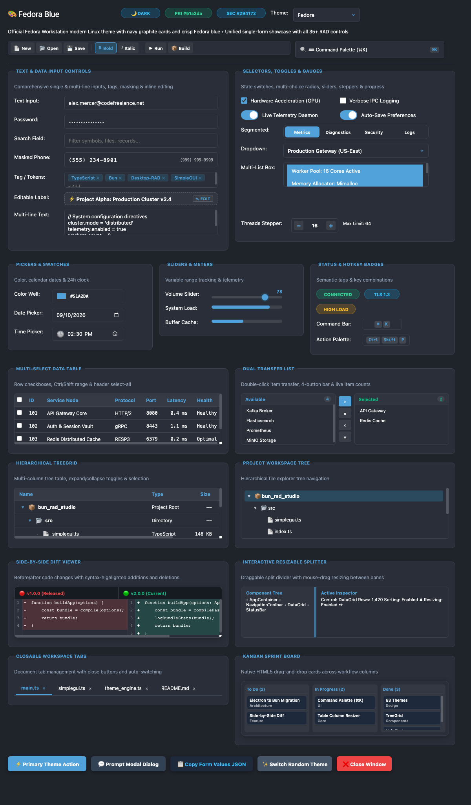

# 🎨 Bun RAD Studio — Complete Theme Visual Gallery (76 Themes)

<a id="top"></a>
Welcome to the **Bun RAD Studio & SimpleGUI Visual Theme Gallery**. Every theme below is built directly into the framework with pixel-perfect color harmony, curated typography, WCAG-tested high contrast, and custom styling for all 30+ desktop RAD controls.

> [!TIP]
> **Interactive Theme Showcase**: Launch a live desktop window showcasing any theme by running:
> ```bash
> bun run demo:themes <theme_name>
> # Examples:
> bun run demo:themes codefreelance
> bun run demo:themes ubuntu_dark
> bun run demo:themes mac_os_aqua
> bun run demo:themes monokai_pro
> ```

<a id="table-of-contents"></a>
## 📑 Table of Contents

- [🌟 Signature & Brand Theme (1 Theme)](#cat-brand)
- [🍏 Modern macOS & Apple Themes (9 Themes)](#cat-macos)
- [🚀 AAA Studio & Designer Dark Themes (14 Themes)](#cat-designer)
- [💻 Popular Developer & IDE Syntax Themes (16 Themes)](#cat-developer)
- [☀️ Clean Light & High-Contrast Themes (6 Themes)](#cat-light)
- [🕹️ Retro & Nostalgic Computing Themes (10 Themes)](#cat-retro)
- [🐧 Modern Linux Desktop Themes (7 Themes)](#cat-linux)
- [⚡ Quick Reference Index Table (All 63 Themes)](#quick-reference-index)
- [💻 How to Use Any Theme in SimpleGUI Code](#how-to-use-any-theme-in-simplegui-code)

---

<a id="cat-brand"></a>
## 🌟 Signature & Brand Theme

The flagship brand theme featuring deep obsidian black and vibrant neon emerald.

<a id="theme-codefreelance"></a>
### 01. CodeFreelance (`codefreelance`)

> Official CodeFreelance dark theme: #050505 obsidian canvas, #121212 cards, #0fb36a neon emerald green & #bd00ff purple accents (codefreelance.net)

- **Mode**: 🌙 Dark | **Primary Accent**: `#0fb36a` | **Secondary**: `#bd00ff`
- **Canvas**: `#050505` | **Card Background**: `#121212` | **Text**: `#ffffff`
- **Live Preview Command**: `bun run demo:themes codefreelance`


<p align="right"><a href="#top">▲ Back to Top</a> • <a href="#table-of-contents">📑 Table of Contents</a> • <a href="#quick-reference-index">⚡ Index Table</a></p>

---

<a id="cat-macos"></a>
## 🍏 Modern macOS & Apple Themes

Authentic Apple operating system designs from classic Mac OS X Aqua to contemporary macOS Sonoma and Apple Sunset.

<a id="theme-sonoma_emerald"></a>
### 02. Sonoma Emerald (`sonoma_emerald`)

> macOS Sonoma dark forest glass palette with radiant emerald and mint accents

- **Mode**: 🌙 Dark | **Primary Accent**: `#30d158` | **Secondary**: `#34d399`
- **Canvas**: `#091811` | **Card Background**: `#10261c` | **Text**: `#ecfdf5`
- **Live Preview Command**: `bun run demo:themes sonoma_emerald`


<p align="right"><a href="#top">▲ Back to Top</a> • <a href="#table-of-contents">📑 Table of Contents</a> • <a href="#quick-reference-index">⚡ Index Table</a></p>

---

<a id="theme-apple_dark"></a>
### 03. Apple Dark (`apple_dark`)

> Vibrant Apple macOS Dark Mode surface with titanium gray cards and iOS system blue

- **Mode**: 🌙 Dark | **Primary Accent**: `#0a84ff` | **Secondary**: `#bf5af2`
- **Canvas**: `#161618` | **Card Background**: `#242426` | **Text**: `#f5f5f7`
- **Live Preview Command**: `bun run demo:themes apple_dark`


<p align="right"><a href="#top">▲ Back to Top</a> • <a href="#table-of-contents">📑 Table of Contents</a> • <a href="#quick-reference-index">⚡ Index Table</a></p>

---

<a id="theme-apple_light"></a>
### 04. Apple Light (`apple_light`)

> Clean Apple macOS Aqua light canvas with SF Pro typography and Cupertino system blue

- **Mode**: ☀️ Light | **Primary Accent**: `#0071e3` | **Secondary**: `#5e5ce6`
- **Canvas**: `#f5f5f7` | **Card Background**: `#ffffff` | **Text**: `#1d1d1f`
- **Live Preview Command**: `bun run demo:themes apple_light`


<p align="right"><a href="#top">▲ Back to Top</a> • <a href="#table-of-contents">📑 Table of Contents</a> • <a href="#quick-reference-index">⚡ Index Table</a></p>

---

<a id="theme-midnight"></a>
### 05. Midnight Space Gray (`midnight`)

> Pro dark titanium space gray theme with deep slate surfaces and luminous sky blue

- **Mode**: 🌙 Dark | **Primary Accent**: `#38bdf8` | **Secondary**: `#818cf8`
- **Canvas**: `#0f1115` | **Card Background**: `#161922` | **Text**: `#e6edf3`
- **Live Preview Command**: `bun run demo:themes midnight`


<p align="right"><a href="#top">▲ Back to Top</a> • <a href="#table-of-contents">📑 Table of Contents</a> • <a href="#quick-reference-index">⚡ Index Table</a></p>

---

<a id="theme-apple_sunset"></a>
### 06. Apple Sunset (`apple_sunset`)

> Warm macOS Mojave twilight sunset hues with rich plum surfaces and neon amber accents

- **Mode**: 🌙 Dark | **Primary Accent**: `#ff7733` | **Secondary**: `#e056fd`
- **Canvas**: `#221526` | **Card Background**: `#2d1e33` | **Text**: `#fdf4f8`
- **Live Preview Command**: `bun run demo:themes apple_sunset`


<p align="right"><a href="#top">▲ Back to Top</a> • <a href="#table-of-contents">📑 Table of Contents</a> • <a href="#quick-reference-index">⚡ Index Table</a></p>

---

<a id="theme-ventura_amber"></a>
### 07. Ventura Amber (`ventura_amber`)

> macOS Ventura golden sunset dark hues with warm amber and roasted espresso cards

- **Mode**: 🌙 Dark | **Primary Accent**: `#ff9500` | **Secondary**: `#f97316`
- **Canvas**: `#1c140e` | **Card Background**: `#281e16` | **Text**: `#fffbeb`
- **Live Preview Command**: `bun run demo:themes ventura_amber`


<p align="right"><a href="#top">▲ Back to Top</a> • <a href="#table-of-contents">📑 Table of Contents</a> • <a href="#quick-reference-index">⚡ Index Table</a></p>

---

<a id="theme-soft_pastel"></a>
### 08. Soft Pastel (`soft_pastel`)

> Apple Studio warm soft linen light theme with terracotta coral and artisan cards

- **Mode**: ☀️ Light | **Primary Accent**: `#c05638` | **Secondary**: `#3d405b`
- **Canvas**: `#f9f6f0` | **Card Background**: `#ffffff` | **Text**: `#1c1917`
- **Live Preview Command**: `bun run demo:themes soft_pastel`


<p align="right"><a href="#top">▲ Back to Top</a> • <a href="#table-of-contents">📑 Table of Contents</a> • <a href="#quick-reference-index">⚡ Index Table</a></p>

---

<a id="theme-mac_os_aqua"></a>
### 09. Mac OS X Aqua (`mac_os_aqua`)

> Early 2001 OS X Cheetah glossy gel buttons and brushed pinstripes

- **Mode**: ☀️ Light | **Primary Accent**: `#0066cc` | **Secondary**: `#ff9500`
- **Canvas**: `#e6ebed` | **Card Background**: `#ffffff` | **Text**: `#0f172a`
- **Live Preview Command**: `bun run demo:themes mac_os_aqua`


<p align="right"><a href="#top">▲ Back to Top</a> • <a href="#table-of-contents">📑 Table of Contents</a> • <a href="#quick-reference-index">⚡ Index Table</a></p>

---

<a id="theme-mac_classic"></a>
### 10. Macintosh System 7 (`mac_classic`)

> Vintage 1991 System 7 Platinum desktop with Chicago typography and pinstripe accents

- **Mode**: ☀️ Light | **Primary Accent**: `#5555aa` | **Secondary**: `#ded9cf`
- **Canvas**: `#ebe7df` | **Card Background**: `#ffffff` | **Text**: `#1c1b18`
- **Live Preview Command**: `bun run demo:themes mac_classic`


<p align="right"><a href="#top">▲ Back to Top</a> • <a href="#table-of-contents">📑 Table of Contents</a> • <a href="#quick-reference-index">⚡ Index Table</a></p>

---

<a id="cat-designer"></a>
## 🚀 AAA Studio & Designer Dark Themes

Premium, modern software company aesthetics engineered for maximum focus and visual hierarchy.

<a id="theme-raycast_dark"></a>
### 11. Raycast Dark (`raycast_dark`)

> Silicon Valley developer command palette with ultra-slick charcoal surfaces and laser red

- **Mode**: 🌙 Dark | **Primary Accent**: `#ff6363` | **Secondary**: `#ff9494`
- **Canvas**: `#0e0f12` | **Card Background**: `#18191e` | **Text**: `#f3f4f6`
- **Live Preview Command**: `bun run demo:themes raycast_dark`


<p align="right"><a href="#top">▲ Back to Top</a> • <a href="#table-of-contents">📑 Table of Contents</a> • <a href="#quick-reference-index">⚡ Index Table</a></p>

---

<a id="theme-linear_dark"></a>
### 12. Linear Studio (`linear_dark`)

> High-craft Linear project workspace with deep obsidian cards and electric indigo accents

- **Mode**: 🌙 Dark | **Primary Accent**: `#5e6ad2` | **Secondary**: `#8e9df6`
- **Canvas**: `#0f1015` | **Card Background**: `#181922` | **Text**: `#e2e4ed`
- **Live Preview Command**: `bun run demo:themes linear_dark`


<p align="right"><a href="#top">▲ Back to Top</a> • <a href="#table-of-contents">📑 Table of Contents</a> • <a href="#quick-reference-index">⚡ Index Table</a></p>

---

<a id="theme-vercel_dark"></a>
### 13. Vercel Geist (`vercel_dark`)

> Ultra-minimalist Next.js & Vercel design system with pure monochrome contrast and electric blue

- **Mode**: 🌙 Dark | **Primary Accent**: `#ffffff` | **Secondary**: `#0070f3`
- **Canvas**: `#000000` | **Card Background**: `#0a0a0a` | **Text**: `#ededed`
- **Live Preview Command**: `bun run demo:themes vercel_dark`


<p align="right"><a href="#top">▲ Back to Top</a> • <a href="#table-of-contents">📑 Table of Contents</a> • <a href="#quick-reference-index">⚡ Index Table</a></p>

---

<a id="theme-unreal_engine"></a>
### 14. Unreal Engine 5 (`unreal_engine`)

> Epic Games Unreal Engine 5 professional workstation with dark graphite & Blueprint blue

- **Mode**: 🌙 Dark | **Primary Accent**: `#0e86d4` | **Secondary**: `#e5a93c`
- **Canvas**: `#18191c` | **Card Background**: `#222328` | **Text**: `#e1e2e6`
- **Live Preview Command**: `bun run demo:themes unreal_engine`


<p align="right"><a href="#top">▲ Back to Top</a> • <a href="#table-of-contents">📑 Table of Contents</a> • <a href="#quick-reference-index">⚡ Index Table</a></p>

---

<a id="theme-arc_velvet"></a>
### 15. Arc Velvet (`arc_velvet`)

> Arc Browser velvet aesthetic with deep plum indigo and luminous neon magenta accents

- **Mode**: 🌙 Dark | **Primary Accent**: `#f72585` | **Secondary**: `#4cc9f0`
- **Canvas**: `#170f26` | **Card Background**: `#23183a` | **Text**: `#f8f6fc`
- **Live Preview Command**: `bun run demo:themes arc_velvet`


<p align="right"><a href="#top">▲ Back to Top</a> • <a href="#table-of-contents">📑 Table of Contents</a> • <a href="#quick-reference-index">⚡ Index Table</a></p>

---

<a id="theme-abyss"></a>
### 16. Abyss Bioluminescence (`abyss`)

> Deep oceanic trench dark theme with radiant bioluminescent cyan and marine slate

- **Mode**: 🌙 Dark | **Primary Accent**: `#06b6d4` | **Secondary**: `#3b82f6`
- **Canvas**: `#030712` | **Card Background**: `#0b1329` | **Text**: `#f0fdfa`
- **Live Preview Command**: `bun run demo:themes abyss`


<p align="right"><a href="#top">▲ Back to Top</a> • <a href="#table-of-contents">📑 Table of Contents</a> • <a href="#quick-reference-index">⚡ Index Table</a></p>

---

<a id="theme-night_city"></a>
### 17. Cyberpunk Night City (`night_city`)

> AAA Cyberpunk 2077 Night City HUD with Trauma Team red, Samurai yellow and chrome cards

- **Mode**: 🌙 Dark | **Primary Accent**: `#ff003c` | **Secondary**: `#00f0ff`
- **Canvas**: `#0e0e13` | **Card Background**: `#171720` | **Text**: `#fcee0a`
- **Live Preview Command**: `bun run demo:themes night_city`


<p align="right"><a href="#top">▲ Back to Top</a> • <a href="#table-of-contents">📑 Table of Contents</a> • <a href="#quick-reference-index">⚡ Index Table</a></p>

---

<a id="theme-horizon"></a>
### 18. Horizon Sunset (`horizon`)

> Warm twilight horizon spectrum with glowing neon coral, peach and dusk plum

- **Mode**: 🌙 Dark | **Primary Accent**: `#e95678` | **Secondary**: `#fab795`
- **Canvas**: `#1c1e26` | **Card Background**: `#232530` | **Text**: `#fdf0ed`
- **Live Preview Command**: `bun run demo:themes horizon`


<p align="right"><a href="#top">▲ Back to Top</a> • <a href="#table-of-contents">📑 Table of Contents</a> • <a href="#quick-reference-index">⚡ Index Table</a></p>

---

<a id="theme-tailwind_dark"></a>
### 19. Tailwind Slate Emerald (`tailwind_dark`)

> Modern Tailwind CSS flagship developer theme with deep slate 950 and vibrant emerald

- **Mode**: 🌙 Dark | **Primary Accent**: `#10b981` | **Secondary**: `#06b6d4`
- **Canvas**: `#0b1120` | **Card Background**: `#151e32` | **Text**: `#f1f5f9`
- **Live Preview Command**: `bun run demo:themes tailwind_dark`


<p align="right"><a href="#top">▲ Back to Top</a> • <a href="#table-of-contents">📑 Table of Contents</a> • <a href="#quick-reference-index">⚡ Index Table</a></p>

---

<a id="theme-supabase"></a>
### 20. Supabase Dark (`supabase`)

> Supabase cloud database dashboard with sleek dark obsidian and signature emerald

- **Mode**: 🌙 Dark | **Primary Accent**: `#3ecf8e` | **Secondary**: `#70e1a5`
- **Canvas**: `#121212` | **Card Background**: `#1c1c1c` | **Text**: `#f8fafc`
- **Live Preview Command**: `bun run demo:themes supabase`


<p align="right"><a href="#top">▲ Back to Top</a> • <a href="#table-of-contents">📑 Table of Contents</a> • <a href="#quick-reference-index">⚡ Index Table</a></p>

---

<a id="theme-oled_black"></a>
### 21. OLED Laser Black (`oled_black`)

> Zero-power pure OLED black canvas with ultra-sharp laser green and high-contrast cards

- **Mode**: 🌙 Dark | **Primary Accent**: `#00e676` | **Secondary**: `#2979ff`
- **Canvas**: `#000000` | **Card Background**: `#0a0a0a` | **Text**: `#ffffff`
- **Live Preview Command**: `bun run demo:themes oled_black`


<p align="right"><a href="#top">▲ Back to Top</a> • <a href="#table-of-contents">📑 Table of Contents</a> • <a href="#quick-reference-index">⚡ Index Table</a></p>

---

<a id="theme-titanium_slate"></a>
### 22. Titanium Slate Pro (`titanium_slate`)

> Apple Pro hardware grade aerospace titanium space black with aviation orange accents

- **Mode**: 🌙 Dark | **Primary Accent**: `#ff6b22` | **Secondary**: `#98989d`
- **Canvas**: `#131417` | **Card Background**: `#1c1d22` | **Text**: `#e5e5ea`
- **Live Preview Command**: `bun run demo:themes titanium_slate`


<p align="right"><a href="#top">▲ Back to Top</a> • <a href="#table-of-contents">📑 Table of Contents</a> • <a href="#quick-reference-index">⚡ Index Table</a></p>

---

<a id="theme-jetbrains_darcula"></a>
### 23. JetBrains Darcula (`jetbrains_darcula`)

> Iconic JetBrains IntelliJ IDEA / PyCharm Darcula IDE workspace with warm syntax orange

- **Mode**: 🌙 Dark | **Primary Accent**: `#cc7832` | **Secondary**: `#6897bb`
- **Canvas**: `#2b2b2b` | **Card Background**: `#313335` | **Text**: `#a9b7c6`
- **Live Preview Command**: `bun run demo:themes jetbrains_darcula`


<p align="right"><a href="#top">▲ Back to Top</a> • <a href="#table-of-contents">📑 Table of Contents</a> • <a href="#quick-reference-index">⚡ Index Table</a></p>

---

<a id="theme-nordic_paper"></a>
### 24. Nordic Paper Light (`nordic_paper`)

> Nordic editorial paper light canvas with deep fjord blue and crisp typographic elegance

- **Mode**: ☀️ Light | **Primary Accent**: `#2b5c8f` | **Secondary**: `#c2593f`
- **Canvas**: `#f7f7f5` | **Card Background**: `#ffffff` | **Text**: `#202124`
- **Live Preview Command**: `bun run demo:themes nordic_paper`


<p align="right"><a href="#top">▲ Back to Top</a> • <a href="#table-of-contents">📑 Table of Contents</a> • <a href="#quick-reference-index">⚡ Index Table</a></p>

---

<a id="cat-developer"></a>
## 💻 Popular Developer & IDE Syntax Themes

World-renowned editor and syntax color schemes beloved by engineers worldwide.

<a id="theme-monokai_pro"></a>
### 25. Monokai Pro (`monokai_pro`)

> Monokai Pro refined dark spectrum with warm yellow and vivid magenta accents

- **Mode**: 🌙 Dark | **Primary Accent**: `#ffd866` | **Secondary**: `#ff6188`
- **Canvas**: `#2d2a2e` | **Card Background**: `#221f22` | **Text**: `#fcfcfa`
- **Live Preview Command**: `bun run demo:themes monokai_pro`


<p align="right"><a href="#top">▲ Back to Top</a> • <a href="#table-of-contents">📑 Table of Contents</a> • <a href="#quick-reference-index">⚡ Index Table</a></p>

---

<a id="theme-tokyo_night"></a>
### 26. Tokyo Night (`tokyo_night`)

> Tokyo Night dark neon indigo city theme with vibrant blue and lavender accents

- **Mode**: 🌙 Dark | **Primary Accent**: `#7aa2f7` | **Secondary**: `#bb9af7`
- **Canvas**: `#1a1b26` | **Card Background**: `#24283b` | **Text**: `#c0caf5`
- **Live Preview Command**: `bun run demo:themes tokyo_night`


<p align="right"><a href="#top">▲ Back to Top</a> • <a href="#table-of-contents">📑 Table of Contents</a> • <a href="#quick-reference-index">⚡ Index Table</a></p>

---

<a id="theme-one_dark_pro"></a>
### 27. One Dark Pro (`one_dark_pro`)

> Iconic Atom & VS Code One Dark Pro deep slate canvas with vibrant syntax hues

- **Mode**: 🌙 Dark | **Primary Accent**: `#61afef` | **Secondary**: `#98c379`
- **Canvas**: `#21252b` | **Card Background**: `#282c34` | **Text**: `#abb2bf`
- **Live Preview Command**: `bun run demo:themes one_dark_pro`


<p align="right"><a href="#top">▲ Back to Top</a> • <a href="#table-of-contents">📑 Table of Contents</a> • <a href="#quick-reference-index">⚡ Index Table</a></p>

---

<a id="theme-gruvbox_dark"></a>
### 28. Gruvbox Dark (`gruvbox_dark`)

> Retro groove warm earthy dark palette with amber gold and terracotta orange

- **Mode**: 🌙 Dark | **Primary Accent**: `#fabd2f` | **Secondary**: `#fe8019`
- **Canvas**: `#282828` | **Card Background**: `#1d2021` | **Text**: `#ebdbb2`
- **Live Preview Command**: `bun run demo:themes gruvbox_dark`


<p align="right"><a href="#top">▲ Back to Top</a> • <a href="#table-of-contents">📑 Table of Contents</a> • <a href="#quick-reference-index">⚡ Index Table</a></p>

---

<a id="theme-rose_pine"></a>
### 29. Rosé Pine (`rose_pine`)

> All-natural soft dark palette with dusty rose, pine foam, and warm gold

- **Mode**: 🌙 Dark | **Primary Accent**: `#eb6f92` | **Secondary**: `#9ccfd8`
- **Canvas**: `#191724` | **Card Background**: `#21202e` | **Text**: `#e0def4`
- **Live Preview Command**: `bun run demo:themes rose_pine`


<p align="right"><a href="#top">▲ Back to Top</a> • <a href="#table-of-contents">📑 Table of Contents</a> • <a href="#quick-reference-index">⚡ Index Table</a></p>

---

<a id="theme-everforest"></a>
### 30. Everforest Dark (`everforest`)

> Natural comfort forest dark mode engineered for zero eye strain

- **Mode**: 🌙 Dark | **Primary Accent**: `#a7c080` | **Secondary**: `#7fbbb3`
- **Canvas**: `#2d353b` | **Card Background**: `#232a2e` | **Text**: `#d3c6aa`
- **Live Preview Command**: `bun run demo:themes everforest`


<p align="right"><a href="#top">▲ Back to Top</a> • <a href="#table-of-contents">📑 Table of Contents</a> • <a href="#quick-reference-index">⚡ Index Table</a></p>

---

<a id="theme-kanagawa"></a>
### 31. Kanagawa (`kanagawa`)

> Japanese ukiyo-e wave art inspired dark sumi ink palette

- **Mode**: 🌙 Dark | **Primary Accent**: `#7e9cd8` | **Secondary**: `#ffa066`
- **Canvas**: `#1f1f28` | **Card Background**: `#16161d` | **Text**: `#dcd7ba`
- **Live Preview Command**: `bun run demo:themes kanagawa`


<p align="right"><a href="#top">▲ Back to Top</a> • <a href="#table-of-contents">📑 Table of Contents</a> • <a href="#quick-reference-index">⚡ Index Table</a></p>

---

<a id="theme-cobalt2"></a>
### 32. Cobalt2 (`cobalt2`)

> Wes Bos official Cobalt2 deep navy blue with brilliant canary yellow accents

- **Mode**: 🌙 Dark | **Primary Accent**: `#ffc600` | **Secondary**: `#0088ff`
- **Canvas**: `#193549` | **Card Background**: `#15232d` | **Text**: `#ffffff`
- **Live Preview Command**: `bun run demo:themes cobalt2`


<p align="right"><a href="#top">▲ Back to Top</a> • <a href="#table-of-contents">📑 Table of Contents</a> • <a href="#quick-reference-index">⚡ Index Table</a></p>

---

<a id="theme-win11_slate"></a>
### 33. Windows 11 Fluent Slate (`win11_slate`)

> Modern Windows 11 Fluent Dark Acrylic with vibrant sky blue accents

- **Mode**: 🌙 Dark | **Primary Accent**: `#60cdff` | **Secondary**: `#0078d4`
- **Canvas**: `#202020` | **Card Background**: `#2c2c2c` | **Text**: `#ffffff`
- **Live Preview Command**: `bun run demo:themes win11_slate`


<p align="right"><a href="#top">▲ Back to Top</a> • <a href="#table-of-contents">📑 Table of Contents</a> • <a href="#quick-reference-index">⚡ Index Table</a></p>

---

<a id="theme-dracula"></a>
### 34. Dracula (`dracula`)

> High-contrast vampire purple palette with gothic violet and neon pink accents

- **Mode**: 🌙 Dark | **Primary Accent**: `#bd93f9` | **Secondary**: `#ff79c6`
- **Canvas**: `#282a36` | **Card Background**: `#21222c` | **Text**: `#f8f8f2`
- **Live Preview Command**: `bun run demo:themes dracula`


<p align="right"><a href="#top">▲ Back to Top</a> • <a href="#table-of-contents">📑 Table of Contents</a> • <a href="#quick-reference-index">⚡ Index Table</a></p>

---

<a id="theme-nord"></a>
### 35. Nord (`nord`)

> Arctic frost Nord developer palette with icy cyan and polar slate surfaces

- **Mode**: 🌙 Dark | **Primary Accent**: `#88c0d0` | **Secondary**: `#81a1c1`
- **Canvas**: `#2e3440` | **Card Background**: `#3b4252` | **Text**: `#eceff4`
- **Live Preview Command**: `bun run demo:themes nord`


<p align="right"><a href="#top">▲ Back to Top</a> • <a href="#table-of-contents">📑 Table of Contents</a> • <a href="#quick-reference-index">⚡ Index Table</a></p>

---

<a id="theme-cyberpunk"></a>
### 36. Cyberpunk (`cyberpunk`)

> Neon glow dark contrast palette with electric magenta and laser cyan

- **Mode**: 🌙 Dark | **Primary Accent**: `#ff007f` | **Secondary**: `#fee440`
- **Canvas**: `#0a0b12` | **Card Background**: `#121320` | **Text**: `#00f5d4`
- **Live Preview Command**: `bun run demo:themes cyberpunk`


<p align="right"><a href="#top">▲ Back to Top</a> • <a href="#table-of-contents">📑 Table of Contents</a> • <a href="#quick-reference-index">⚡ Index Table</a></p>

---

<a id="theme-github_dark"></a>
### 37. GitHub Dark (`github_dark`)

> Official GitHub dark interface palette with refined code repository slate cards

- **Mode**: 🌙 Dark | **Primary Accent**: `#58a6ff` | **Secondary**: `#3fb950`
- **Canvas**: `#0d1117` | **Card Background**: `#161b22` | **Text**: `#e6edf3`
- **Live Preview Command**: `bun run demo:themes github_dark`


<p align="right"><a href="#top">▲ Back to Top</a> • <a href="#table-of-contents">📑 Table of Contents</a> • <a href="#quick-reference-index">⚡ Index Table</a></p>

---

<a id="theme-solarized_dark"></a>
### 38. Solarized Dark (`solarized_dark`)

> Precision engineered dark palette with optimized teal-slate contrast

- **Mode**: 🌙 Dark | **Primary Accent**: `#2aa198` | **Secondary**: `#268bd2`
- **Canvas**: `#002b36` | **Card Background**: `#073642` | **Text**: `#eee8d5`
- **Live Preview Command**: `bun run demo:themes solarized_dark`


<p align="right"><a href="#top">▲ Back to Top</a> • <a href="#table-of-contents">📑 Table of Contents</a> • <a href="#quick-reference-index">⚡ Index Table</a></p>

---

<a id="theme-aura"></a>
### 39. Aura Dark (`aura`)

> Lush mystical dark theme with ethereal neon purple and mint green accents

- **Mode**: 🌙 Dark | **Primary Accent**: `#a277ff` | **Secondary**: `#61ffca`
- **Canvas**: `#15141b` | **Card Background**: `#1f1d2b` | **Text**: `#edecee`
- **Live Preview Command**: `bun run demo:themes aura`


<p align="right"><a href="#top">▲ Back to Top</a> • <a href="#table-of-contents">📑 Table of Contents</a> • <a href="#quick-reference-index">⚡ Index Table</a></p>

---

<a id="theme-catppuccin"></a>
### 40. Catppuccin Mocha (`catppuccin`)

> Soothing lavender Catppuccin Mocha dark mode with pastel mauve and pink accents

- **Mode**: 🌙 Dark | **Primary Accent**: `#cba6f7` | **Secondary**: `#f5c2e7`
- **Canvas**: `#1e1e2e` | **Card Background**: `#242438` | **Text**: `#cdd6f4`
- **Live Preview Command**: `bun run demo:themes catppuccin`


<p align="right"><a href="#top">▲ Back to Top</a> • <a href="#table-of-contents">📑 Table of Contents</a> • <a href="#quick-reference-index">⚡ Index Table</a></p>

---

<a id="cat-light"></a>
## ☀️ Clean Light & High-Contrast Themes

Optimized daytime reading themes with clear visual borders and WCAG AAA contrast compliance.

<a id="theme-github_light"></a>
### 41. GitHub Light (`github_light`)

> Clean official GitHub light canvas palette with crisp borders and classic blue

- **Mode**: ☀️ Light | **Primary Accent**: `#0969da` | **Secondary**: `#1a7f37`
- **Canvas**: `#f6f8fa` | **Card Background**: `#ffffff` | **Text**: `#1f2328`
- **Live Preview Command**: `bun run demo:themes github_light`


<p align="right"><a href="#top">▲ Back to Top</a> • <a href="#table-of-contents">📑 Table of Contents</a> • <a href="#quick-reference-index">⚡ Index Table</a></p>

---

<a id="theme-solarized_light"></a>
### 42. Solarized Light (`solarized_light`)

> Precision engineered light palette for maximum reading comfort

- **Mode**: ☀️ Light | **Primary Accent**: `#268bd2` | **Secondary**: `#2aa198`
- **Canvas**: `#fdf6e3` | **Card Background**: `#eee8d5` | **Text**: `#073642`
- **Live Preview Command**: `bun run demo:themes solarized_light`


<p align="right"><a href="#top">▲ Back to Top</a> • <a href="#table-of-contents">📑 Table of Contents</a> • <a href="#quick-reference-index">⚡ Index Table</a></p>

---

<a id="theme-win11_light"></a>
### 43. Windows 11 Mica Light (`win11_light`)

> Modern Windows 11 Mica Light desktop with crisp Fluent typography

- **Mode**: ☀️ Light | **Primary Accent**: `#005fb8` | **Secondary**: `#0078d4`
- **Canvas**: `#f3f3f3` | **Card Background**: `#ffffff` | **Text**: `#1b1b1b`
- **Live Preview Command**: `bun run demo:themes win11_light`


<p align="right"><a href="#top">▲ Back to Top</a> • <a href="#table-of-contents">📑 Table of Contents</a> • <a href="#quick-reference-index">⚡ Index Table</a></p>

---

<a id="theme-gruvbox_light"></a>
### 44. Gruvbox Light (`gruvbox_light`)

> Retro groove parchment light canvas with earthy amber and walnut tones

- **Mode**: ☀️ Light | **Primary Accent**: `#b57614` | **Secondary**: `#af3a03`
- **Canvas**: `#fbf1c7` | **Card Background**: `#f2e5bc` | **Text**: `#3c3836`
- **Live Preview Command**: `bun run demo:themes gruvbox_light`


<p align="right"><a href="#top">▲ Back to Top</a> • <a href="#table-of-contents">📑 Table of Contents</a> • <a href="#quick-reference-index">⚡ Index Table</a></p>

---

<a id="theme-forest_green"></a>
### 45. Forest Green (`forest_green`)

> Rich botanical evergreen forest dark theme with moss cards and radiant jade accents

- **Mode**: 🌙 Dark | **Primary Accent**: `#4ade80` | **Secondary**: `#86efac`
- **Canvas**: `#0b1f14` | **Card Background**: `#122e1f` | **Text**: `#f0fdf4`
- **Live Preview Command**: `bun run demo:themes forest_green`


<p align="right"><a href="#top">▲ Back to Top</a> • <a href="#table-of-contents">📑 Table of Contents</a> • <a href="#quick-reference-index">⚡ Index Table</a></p>

---

<a id="theme-navy_blue"></a>
### 46. Navy Blue (`navy_blue`)

> Executive maritime deep slate navy dark theme with oceanic blue surfaces

- **Mode**: 🌙 Dark | **Primary Accent**: `#38bdf8` | **Secondary**: `#6366f1`
- **Canvas**: `#0a0f1d` | **Card Background**: `#111c33` | **Text**: `#f8fafc`
- **Live Preview Command**: `bun run demo:themes navy_blue`


<p align="right"><a href="#top">▲ Back to Top</a> • <a href="#table-of-contents">📑 Table of Contents</a> • <a href="#quick-reference-index">⚡ Index Table</a></p>

---

<a id="cat-retro"></a>
## 🕹️ Retro & Nostalgic Computing Themes

Faithful recreations of vintage computing hardware, phosphor CRTs, and retro gaming consoles.

<a id="theme-win95"></a>
### 47. Windows 95 (`win95`)

> Iconic Windows 95 classic teal desktop with silver 3D beveled cards and titlebar navy

- **Mode**: ☀️ Light | **Primary Accent**: `#000080` | **Secondary**: `#c0c0c0`
- **Canvas**: `#008080` | **Card Background**: `#c0c0c0` | **Text**: `#000000`
- **Live Preview Command**: `bun run demo:themes win95`


<p align="right"><a href="#top">▲ Back to Top</a> • <a href="#table-of-contents">📑 Table of Contents</a> • <a href="#quick-reference-index">⚡ Index Table</a></p>

---

<a id="theme-gameboy"></a>
### 48. Game Boy 1989 (`gameboy`)

> Nostalgic 4-shade monochrome dot matrix Game Boy DMG-01 screen

- **Mode**: 🌙 Dark | **Primary Accent**: `#8bac0f` | **Secondary**: `#306230`
- **Canvas**: `#0f380f` | **Card Background**: `#1c4a1c` | **Text**: `#9bbc0f`
- **Live Preview Command**: `bun run demo:themes gameboy`


<p align="right"><a href="#top">▲ Back to Top</a> • <a href="#table-of-contents">📑 Table of Contents</a> • <a href="#quick-reference-index">⚡ Index Table</a></p>

---

<a id="theme-c64"></a>
### 49. Commodore 64 (`c64`)

> Legendary 1982 Commodore 64 READY prompt and VIC-II blue palette

- **Mode**: 🌙 Dark | **Primary Accent**: `#7974ff` | **Secondary**: `#a09eff`
- **Canvas**: `#40318d` | **Card Background**: `#281b5c` | **Text**: `#b8b5ff`
- **Live Preview Command**: `bun run demo:themes c64`


<p align="right"><a href="#top">▲ Back to Top</a> • <a href="#table-of-contents">📑 Table of Contents</a> • <a href="#quick-reference-index">⚡ Index Table</a></p>

---

<a id="theme-amber_crt"></a>
### 50. Phosphor Amber CRT (`amber_crt`)

> Warm VT220 / Pip-Boy amber phosphor monochrome terminal cathode glow

- **Mode**: 🌙 Dark | **Primary Accent**: `#ffb000` | **Secondary**: `#ff9000`
- **Canvas**: `#0a0600` | **Card Background**: `#160d00` | **Text**: `#ffb000`
- **Live Preview Command**: `bun run demo:themes amber_crt`


<p align="right"><a href="#top">▲ Back to Top</a> • <a href="#table-of-contents">📑 Table of Contents</a> • <a href="#quick-reference-index">⚡ Index Table</a></p>

---

<a id="theme-matrix"></a>
### 51. Matrix Phosphor (`matrix`)

> Iconic 1999 digital rain phosphor green mainframe terminal

- **Mode**: 🌙 Dark | **Primary Accent**: `#00ff41` | **Secondary**: `#03a628`
- **Canvas**: `#040a05` | **Card Background**: `#08140a` | **Text**: `#00ff66`
- **Live Preview Command**: `bun run demo:themes matrix`


<p align="right"><a href="#top">▲ Back to Top</a> • <a href="#table-of-contents">📑 Table of Contents</a> • <a href="#quick-reference-index">⚡ Index Table</a></p>

---

<a id="theme-synthwave"></a>
### 52. Synthwave '84 (`synthwave`)

> 1980s neon synthwave, sunset magenta grid, and retro arcade glow

- **Mode**: 🌙 Dark | **Primary Accent**: `#ff2a85` | **Secondary**: `#05d9e8`
- **Canvas**: `#130924` | **Card Background**: `#22113d` | **Text**: `#fce7f3`
- **Live Preview Command**: `bun run demo:themes synthwave`


<p align="right"><a href="#top">▲ Back to Top</a> • <a href="#table-of-contents">📑 Table of Contents</a> • <a href="#quick-reference-index">⚡ Index Table</a></p>

---

<a id="theme-amiga"></a>
### 53. Amiga Workbench (`amiga`)

> Retro Amiga 500 Workbench 1.3 royal blue, orange buttons, and Topaz white

- **Mode**: 🌙 Dark | **Primary Accent**: `#ff8800` | **Secondary**: `#003b77`
- **Canvas**: `#0055aa` | **Card Background**: `#003870` | **Text**: `#ffffff`
- **Live Preview Command**: `bun run demo:themes amiga`


<p align="right"><a href="#top">▲ Back to Top</a> • <a href="#table-of-contents">📑 Table of Contents</a> • <a href="#quick-reference-index">⚡ Index Table</a></p>

---

<a id="theme-nextstep"></a>
### 54. NeXTSTEP 1989 (`nextstep`)

> Steve Jobs 1989 NeXTSTEP UNIX workstation dark minimalist elegance

- **Mode**: 🌙 Dark | **Primary Accent**: `#4a90e2` | **Secondary**: `#707070`
- **Canvas**: `#262626` | **Card Background**: `#333333` | **Text**: `#dedede`
- **Live Preview Command**: `bun run demo:themes nextstep`


<p align="right"><a href="#top">▲ Back to Top</a> • <a href="#table-of-contents">📑 Table of Contents</a> • <a href="#quick-reference-index">⚡ Index Table</a></p>

---

<a id="theme-hotdog_stand"></a>
### 55. Hot Dog Stand (`hotdog_stand`)

> Unforgettable Windows 3.1 1992 Hot Dog Stand high-contrast yellow & red

- **Mode**: 🌙 Dark | **Primary Accent**: `#ff0000` | **Secondary**: `#ffff00`
- **Canvas**: `#000000` | **Card Background**: `#1c0000` | **Text**: `#ffffff`
- **Live Preview Command**: `bun run demo:themes hotdog_stand`


<p align="right"><a href="#top">▲ Back to Top</a> • <a href="#table-of-contents">📑 Table of Contents</a> • <a href="#quick-reference-index">⚡ Index Table</a></p>

---

<a id="theme-playstation"></a>
### 56. PlayStation 1994 (`playstation`)

> 1994 PSX console grey with iconic geometric controller accents

- **Mode**: 🌙 Dark | **Primary Accent**: `#00d2c4` | **Secondary**: `#f44336`
- **Canvas**: `#1e1e24` | **Card Background**: `#2a2b34` | **Text**: `#e4e5eb`
- **Live Preview Command**: `bun run demo:themes playstation`


<p align="right"><a href="#top">▲ Back to Top</a> • <a href="#table-of-contents">📑 Table of Contents</a> • <a href="#quick-reference-index">⚡ Index Table</a></p>

---

<a id="cat-linux"></a>
## 🐧 Modern Linux Desktop Themes

Authentic Linux desktop operating system styling covering Ubuntu Yaru, GNOME Libadwaita, Linux Mint Cinnamon, System76 Pop!_OS, and Fedora Workstation.

<a id="theme-ubuntu_dark"></a>
### 57. Ubuntu Yaru Dark (`ubuntu_dark`)

> Official Ubuntu Yaru modern Linux dark desktop with warm aubergine charcoal surfaces and signature Ubuntu orange accents

- **Mode**: 🌙 Dark | **Primary Accent**: `#e95420` | **Secondary**: `#77216f`
- **Canvas**: `#242424` | **Card Background**: `#303030` | **Text**: `#ffffff`
- **Live Preview Command**: `bun run demo:themes ubuntu_dark`



<p align="right"><a href="#top">▲ Back to Top</a> • <a href="#table-of-contents">📑 Table of Contents</a> • <a href="#quick-reference-index">⚡ Index Table</a></p>

---

<a id="theme-ubuntu_light"></a>
### 58. Ubuntu Yaru Light (`ubuntu_light`)

> Clean Ubuntu Yaru modern Linux light desktop with crisp white surfaces, warm gray borders, and vibrant Ubuntu orange

- **Mode**: ☀️ Light | **Primary Accent**: `#e95420` | **Secondary**: `#77216f`
- **Canvas**: `#f7f7f7` | **Card Background**: `#ffffff` | **Text**: `#1e1e1e`
- **Live Preview Command**: `bun run demo:themes ubuntu_light`



<p align="right"><a href="#top">▲ Back to Top</a> • <a href="#table-of-contents">📑 Table of Contents</a> • <a href="#quick-reference-index">⚡ Index Table</a></p>

---

<a id="theme-adwaita_dark"></a>
### 59. GNOME Adwaita Dark (`adwaita_dark`)

> Modern GNOME Libadwaita desktop theme with deep slate surfaces and signature Adwaita blue accents

- **Mode**: 🌙 Dark | **Primary Accent**: `#3584e4` | **Secondary**: `#1c71d8`
- **Canvas**: `#242424` | **Card Background**: `#303030` | **Text**: `#ffffff`
- **Live Preview Command**: `bun run demo:themes adwaita_dark`



<p align="right"><a href="#top">▲ Back to Top</a> • <a href="#table-of-contents">📑 Table of Contents</a> • <a href="#quick-reference-index">⚡ Index Table</a></p>

---

<a id="theme-adwaita_light"></a>
### 60. GNOME Adwaita Light (`adwaita_light`)

> Clean GNOME Libadwaita light desktop with neutral paper surfaces and signature blue controls

- **Mode**: ☀️ Light | **Primary Accent**: `#3584e4` | **Secondary**: `#1c71d8`
- **Canvas**: `#fafafa` | **Card Background**: `#ffffff` | **Text**: `#2e3436`
- **Live Preview Command**: `bun run demo:themes adwaita_light`



<p align="right"><a href="#top">▲ Back to Top</a> • <a href="#table-of-contents">📑 Table of Contents</a> • <a href="#quick-reference-index">⚡ Index Table</a></p>

---

<a id="theme-linux_mint"></a>
### 61. Linux Mint Dark (`linux_mint`)

> Modern Linux Mint Cinnamon desktop theme with slate graphite surfaces and signature mint green accents

- **Mode**: 🌙 Dark | **Primary Accent**: `#87a556` | **Secondary**: `#2ebd59`
- **Canvas**: `#2f343f` | **Card Background**: `#242831` | **Text**: `#e0e2e4`
- **Live Preview Command**: `bun run demo:themes linux_mint`



<p align="right"><a href="#top">▲ Back to Top</a> • <a href="#table-of-contents">📑 Table of Contents</a> • <a href="#quick-reference-index">⚡ Index Table</a></p>

---

<a id="theme-pop_os"></a>
### 62. Pop!_OS Dark (`pop_os`)

> System76 Pop!_OS and COSMIC modern Linux desktop with dark charcoal surfaces and signature teal and amber accents

- **Mode**: 🌙 Dark | **Primary Accent**: `#48b9c7` | **Secondary**: `#faa41a`
- **Canvas**: `#202222` | **Card Background**: `#2c2e2e` | **Text**: `#f6f6f6`
- **Live Preview Command**: `bun run demo:themes pop_os`



<p align="right"><a href="#top">▲ Back to Top</a> • <a href="#table-of-contents">📑 Table of Contents</a> • <a href="#quick-reference-index">⚡ Index Table</a></p>

---

<a id="theme-fedora_dark"></a>
### 63. Fedora Blue (`fedora_dark`)

> Official Fedora Workstation modern Linux theme with navy graphite cards and crisp Fedora blue

- **Mode**: 🌙 Dark | **Primary Accent**: `#51a2da` | **Secondary**: `#294172`
- **Canvas**: `#1f232a` | **Card Background**: `#292e38` | **Text**: `#ffffff`
- **Live Preview Command**: `bun run demo:themes fedora_dark`



<p align="right"><a href="#top">▲ Back to Top</a> • <a href="#table-of-contents">📑 Table of Contents</a> • <a href="#quick-reference-index">⚡ Index Table</a></p>

---

<a id="quick-reference-index"></a>
## ⚡ Quick Reference Index Table (All 63 Themes)

| # | Theme Key | Display Name | Mode | Primary Accent | Secondary | Background | Quick Screenshot |
|---|---|---|---|---|---|---|---|
| **01** | `codefreelance` | **CodeFreelance** | 🌙 Dark | `#0fb36a` | `#bd00ff` | `#050505` | [🖼️ View Screenshot](#theme-codefreelance) |
| **02** | `sonoma_emerald` | **Sonoma Emerald** | 🌙 Dark | `#30d158` | `#34d399` | `#091811` | [🖼️ View Screenshot](#theme-sonoma_emerald) |
| **03** | `apple_dark` | **Apple Dark** | 🌙 Dark | `#0a84ff` | `#bf5af2` | `#161618` | [🖼️ View Screenshot](#theme-apple_dark) |
| **04** | `apple_light` | **Apple Light** | ☀️ Light | `#0071e3` | `#5e5ce6` | `#f5f5f7` | [🖼️ View Screenshot](#theme-apple_light) |
| **05** | `midnight` | **Midnight Space Gray** | 🌙 Dark | `#38bdf8` | `#818cf8` | `#0f1115` | [🖼️ View Screenshot](#theme-midnight) |
| **06** | `apple_sunset` | **Apple Sunset** | 🌙 Dark | `#ff7733` | `#e056fd` | `#221526` | [🖼️ View Screenshot](#theme-apple_sunset) |
| **07** | `ventura_amber` | **Ventura Amber** | 🌙 Dark | `#ff9500` | `#f97316` | `#1c140e` | [🖼️ View Screenshot](#theme-ventura_amber) |
| **08** | `soft_pastel` | **Soft Pastel** | ☀️ Light | `#c05638` | `#3d405b` | `#f9f6f0` | [🖼️ View Screenshot](#theme-soft_pastel) |
| **09** | `mac_os_aqua` | **Mac OS X Aqua** | ☀️ Light | `#0066cc` | `#ff9500` | `#e6ebed` | [🖼️ View Screenshot](#theme-mac_os_aqua) |
| **10** | `mac_classic` | **Macintosh System 7** | ☀️ Light | `#5555aa` | `#ded9cf` | `#ebe7df` | [🖼️ View Screenshot](#theme-mac_classic) |
| **11** | `raycast_dark` | **Raycast Dark** | 🌙 Dark | `#ff6363` | `#ff9494` | `#0e0f12` | [🖼️ View Screenshot](#theme-raycast_dark) |
| **12** | `linear_dark` | **Linear Studio** | 🌙 Dark | `#5e6ad2` | `#8e9df6` | `#0f1015` | [🖼️ View Screenshot](#theme-linear_dark) |
| **13** | `vercel_dark` | **Vercel Geist** | 🌙 Dark | `#ffffff` | `#0070f3` | `#000000` | [🖼️ View Screenshot](#theme-vercel_dark) |
| **14** | `unreal_engine` | **Unreal Engine 5** | 🌙 Dark | `#0e86d4` | `#e5a93c` | `#18191c` | [🖼️ View Screenshot](#theme-unreal_engine) |
| **15** | `arc_velvet` | **Arc Velvet** | 🌙 Dark | `#f72585` | `#4cc9f0` | `#170f26` | [🖼️ View Screenshot](#theme-arc_velvet) |
| **16** | `abyss` | **Abyss Bioluminescence** | 🌙 Dark | `#06b6d4` | `#3b82f6` | `#030712` | [🖼️ View Screenshot](#theme-abyss) |
| **17** | `night_city` | **Cyberpunk Night City** | 🌙 Dark | `#ff003c` | `#00f0ff` | `#0e0e13` | [🖼️ View Screenshot](#theme-night_city) |
| **18** | `horizon` | **Horizon Sunset** | 🌙 Dark | `#e95678` | `#fab795` | `#1c1e26` | [🖼️ View Screenshot](#theme-horizon) |
| **19** | `tailwind_dark` | **Tailwind Slate Emerald** | 🌙 Dark | `#10b981` | `#06b6d4` | `#0b1120` | [🖼️ View Screenshot](#theme-tailwind_dark) |
| **20** | `supabase` | **Supabase Dark** | 🌙 Dark | `#3ecf8e` | `#70e1a5` | `#121212` | [🖼️ View Screenshot](#theme-supabase) |
| **21** | `oled_black` | **OLED Laser Black** | 🌙 Dark | `#00e676` | `#2979ff` | `#000000` | [🖼️ View Screenshot](#theme-oled_black) |
| **22** | `titanium_slate` | **Titanium Slate Pro** | 🌙 Dark | `#ff6b22` | `#98989d` | `#131417` | [🖼️ View Screenshot](#theme-titanium_slate) |
| **23** | `jetbrains_darcula` | **JetBrains Darcula** | 🌙 Dark | `#cc7832` | `#6897bb` | `#2b2b2b` | [🖼️ View Screenshot](#theme-jetbrains_darcula) |
| **24** | `nordic_paper` | **Nordic Paper Light** | ☀️ Light | `#2b5c8f` | `#c2593f` | `#f7f7f5` | [🖼️ View Screenshot](#theme-nordic_paper) |
| **25** | `monokai_pro` | **Monokai Pro** | 🌙 Dark | `#ffd866` | `#ff6188` | `#2d2a2e` | [🖼️ View Screenshot](#theme-monokai_pro) |
| **26** | `tokyo_night` | **Tokyo Night** | 🌙 Dark | `#7aa2f7` | `#bb9af7` | `#1a1b26` | [🖼️ View Screenshot](#theme-tokyo_night) |
| **27** | `one_dark_pro` | **One Dark Pro** | 🌙 Dark | `#61afef` | `#98c379` | `#21252b` | [🖼️ View Screenshot](#theme-one_dark_pro) |
| **28** | `gruvbox_dark` | **Gruvbox Dark** | 🌙 Dark | `#fabd2f` | `#fe8019` | `#282828` | [🖼️ View Screenshot](#theme-gruvbox_dark) |
| **29** | `rose_pine` | **Rosé Pine** | 🌙 Dark | `#eb6f92` | `#9ccfd8` | `#191724` | [🖼️ View Screenshot](#theme-rose_pine) |
| **30** | `everforest` | **Everforest Dark** | 🌙 Dark | `#a7c080` | `#7fbbb3` | `#2d353b` | [🖼️ View Screenshot](#theme-everforest) |
| **31** | `kanagawa` | **Kanagawa** | 🌙 Dark | `#7e9cd8` | `#ffa066` | `#1f1f28` | [🖼️ View Screenshot](#theme-kanagawa) |
| **32** | `cobalt2` | **Cobalt2** | 🌙 Dark | `#ffc600` | `#0088ff` | `#193549` | [🖼️ View Screenshot](#theme-cobalt2) |
| **33** | `win11_slate` | **Windows 11 Fluent Slate** | 🌙 Dark | `#60cdff` | `#0078d4` | `#202020` | [🖼️ View Screenshot](#theme-win11_slate) |
| **34** | `dracula` | **Dracula** | 🌙 Dark | `#bd93f9` | `#ff79c6` | `#282a36` | [🖼️ View Screenshot](#theme-dracula) |
| **35** | `nord` | **Nord** | 🌙 Dark | `#88c0d0` | `#81a1c1` | `#2e3440` | [🖼️ View Screenshot](#theme-nord) |
| **36** | `cyberpunk` | **Cyberpunk** | 🌙 Dark | `#ff007f` | `#fee440` | `#0a0b12` | [🖼️ View Screenshot](#theme-cyberpunk) |
| **37** | `github_dark` | **GitHub Dark** | 🌙 Dark | `#58a6ff` | `#3fb950` | `#0d1117` | [🖼️ View Screenshot](#theme-github_dark) |
| **38** | `solarized_dark` | **Solarized Dark** | 🌙 Dark | `#2aa198` | `#268bd2` | `#002b36` | [🖼️ View Screenshot](#theme-solarized_dark) |
| **39** | `aura` | **Aura Dark** | 🌙 Dark | `#a277ff` | `#61ffca` | `#15141b` | [🖼️ View Screenshot](#theme-aura) |
| **40** | `catppuccin` | **Catppuccin Mocha** | 🌙 Dark | `#cba6f7` | `#f5c2e7` | `#1e1e2e` | [🖼️ View Screenshot](#theme-catppuccin) |
| **41** | `github_light` | **GitHub Light** | ☀️ Light | `#0969da` | `#1a7f37` | `#f6f8fa` | [🖼️ View Screenshot](#theme-github_light) |
| **42** | `solarized_light` | **Solarized Light** | ☀️ Light | `#268bd2` | `#2aa198` | `#fdf6e3` | [🖼️ View Screenshot](#theme-solarized_light) |
| **43** | `win11_light` | **Windows 11 Mica Light** | ☀️ Light | `#005fb8` | `#0078d4` | `#f3f3f3` | [🖼️ View Screenshot](#theme-win11_light) |
| **44** | `gruvbox_light` | **Gruvbox Light** | ☀️ Light | `#b57614` | `#af3a03` | `#fbf1c7` | [🖼️ View Screenshot](#theme-gruvbox_light) |
| **45** | `forest_green` | **Forest Green** | 🌙 Dark | `#4ade80` | `#86efac` | `#0b1f14` | [🖼️ View Screenshot](#theme-forest_green) |
| **46** | `navy_blue` | **Navy Blue** | 🌙 Dark | `#38bdf8` | `#6366f1` | `#0a0f1d` | [🖼️ View Screenshot](#theme-navy_blue) |
| **47** | `win95` | **Windows 95** | ☀️ Light | `#000080` | `#c0c0c0` | `#008080` | [🖼️ View Screenshot](#theme-win95) |
| **48** | `gameboy` | **Game Boy 1989** | 🌙 Dark | `#8bac0f` | `#306230` | `#0f380f` | [🖼️ View Screenshot](#theme-gameboy) |
| **49** | `c64` | **Commodore 64** | 🌙 Dark | `#7974ff` | `#a09eff` | `#40318d` | [🖼️ View Screenshot](#theme-c64) |
| **50** | `amber_crt` | **Phosphor Amber CRT** | 🌙 Dark | `#ffb000` | `#ff9000` | `#0a0600` | [🖼️ View Screenshot](#theme-amber_crt) |
| **51** | `matrix` | **Matrix Phosphor** | 🌙 Dark | `#00ff41` | `#03a628` | `#040a05` | [🖼️ View Screenshot](#theme-matrix) |
| **52** | `synthwave` | **Synthwave '84** | 🌙 Dark | `#ff2a85` | `#05d9e8` | `#130924` | [🖼️ View Screenshot](#theme-synthwave) |
| **53** | `amiga` | **Amiga Workbench** | 🌙 Dark | `#ff8800` | `#003b77` | `#0055aa` | [🖼️ View Screenshot](#theme-amiga) |
| **54** | `nextstep` | **NeXTSTEP 1989** | 🌙 Dark | `#4a90e2` | `#707070` | `#262626` | [🖼️ View Screenshot](#theme-nextstep) |
| **55** | `hotdog_stand` | **Hot Dog Stand** | 🌙 Dark | `#ff0000` | `#ffff00` | `#000000` | [🖼️ View Screenshot](#theme-hotdog_stand) |
| **56** | `playstation` | **PlayStation 1994** | 🌙 Dark | `#00d2c4` | `#f44336` | `#1e1e24` | [🖼️ View Screenshot](#theme-playstation) |
| **57** | `ubuntu_dark` | **Ubuntu Yaru Dark** | 🌙 Dark | `#e95420` | `#77216f` | `#242424` | [🖼️ View Screenshot](#theme-ubuntu_dark) |
| **58** | `ubuntu_light` | **Ubuntu Yaru Light** | ☀️ Light | `#e95420` | `#77216f` | `#f7f7f7` | [🖼️ View Screenshot](#theme-ubuntu_light) |
| **59** | `adwaita_dark` | **GNOME Adwaita Dark** | 🌙 Dark | `#3584e4` | `#1c71d8` | `#242424` | [🖼️ View Screenshot](#theme-adwaita_dark) |
| **60** | `adwaita_light` | **GNOME Adwaita Light** | ☀️ Light | `#3584e4` | `#1c71d8` | `#fafafa` | [🖼️ View Screenshot](#theme-adwaita_light) |
| **61** | `linux_mint` | **Linux Mint Dark** | 🌙 Dark | `#87a556` | `#2ebd59` | `#2f343f` | [🖼️ View Screenshot](#theme-linux_mint) |
| **62** | `pop_os` | **Pop!_OS Dark** | 🌙 Dark | `#48b9c7` | `#faa41a` | `#202222` | [🖼️ View Screenshot](#theme-pop_os) |
| **63** | `fedora_dark` | **Fedora Blue** | 🌙 Dark | `#51a2da` | `#294172` | `#1f232a` | [🖼️ View Screenshot](#theme-fedora_dark) |

---

## 💻 How to Use Any Theme in SimpleGUI Code

### Method 1: Specify Theme at Window Creation

```typescript
import { createWindow } from "./index.ts";

// Create a desktop window using any of the 63 built-in themes
const win = createWindow("My Desktop Application", 840, 600, {
    theme: "mac_os_aqua" // or "codefreelance", "tokyo_night", "win95", etc.
});
```

### Method 2: Dynamic Theme Switching at Runtime

```typescript
// Change theme dynamically in response to user events
win.setTheme("monokai_pro", true);

// Or add a built-in theme selector dropdown to your UI with 1 line of code:
win.addThemeSelector("dd_theme", "Theme:", false, 160);
```

### Method 3: Command-Line Demo Runner

```bash
bun run demo:themes <theme_name>
```

---

<a id="vlang-parity-themes"></a>
## 👑 Vlang Webview RAD Studio 76 Desktop Themes Parity Matrix

Full 1:1 cross-platform parity with all 76 desktop form themes from [`vlang_webview_rad_studio`](https://github.com/codecaine-zz/vlang_webview_rad_studio). All themes are accessible via `getTheme(name)`, `getThemeNames()`, `get_theme_names()`, or passed directly to `createWindow(..., { theme })`.

| # | Theme Key | Display Name | Mode | Canvas | Text | Primary Accent | Secondary Accent | Card Background | Card Border |
|---|-----------|--------------|------|--------|------|----------------|------------------|-----------------|-------------|
| 01 | `abyss` | **Abyss Bioluminescence** | 🌙 Dark | `#030712` | `#f0fdfa` | `#06b6d4` | `#3b82f6` | `#0b1329` | `#16274e` |
| 02 | `adwaita_dark` | **GNOME Adwaita Dark** | 🌙 Dark | `#242424` | `#ffffff` | `#3584e4` | `#1c71d8` | `#303030` | `#3d3d3d` |
| 03 | `adwaita_light` | **GNOME Adwaita Light** | ☀️ Light | `#fafafa` | `#2e3436` | `#3584e4` | `#1c71d8` | `#ffffff` | `#dcdcdc` |
| 04 | `amber_crt` | **Amber CRT Terminal** | 🌙 Dark | `#140c00` | `#ffb000` | `#ff9000` | `#cc7000` | `#1f1300` | `#8a5000` |
| 05 | `amethyst` | **Amethyst Purple** | 🌙 Dark | `#160d24` | `#f3e8ff` | `#a855f7` | `#c084fc` | `#201335` | `#331f54` |
| 06 | `amiga` | **Commodore Amiga Workbench** | 🌙 Dark | `#0055aa` | `#ffffff` | `#ff8800` | `#ffffff` | `#ffffff` | `#000000` |
| 07 | `apple_dark` | **Apple Dark** | 🌙 Dark | `#161618` | `#f5f5f7` | `#0a84ff` | `#bf5af2` | `#242426` | `#38383a` |
| 08 | `apple_light` | **Apple Light** | ☀️ Light | `#f5f5f7` | `#1d1d1f` | `#0071e3` | `#5e5ce6` | `#ffffff` | `#e5e5e7` |
| 09 | `apple_sunset` | **Apple Sunset** | 🌙 Dark | `#221526` | `#fdf4f8` | `#ff7733` | `#e056fd` | `#2d1e33` | `#46314f` |
| 10 | `arc_velvet` | **Arc Velvet** | 🌙 Dark | `#170f26` | `#f8f6fc` | `#f72585` | `#4cc9f0` | `#23183a` | `#3d2b63` |
| 11 | `aura` | **Aura Dark** | 🌙 Dark | `#15141b` | `#edecee` | `#a277ff` | `#61ffca` | `#1f1d2b` | `#322f44` |
| 12 | `catppuccin` | **Catppuccin Mocha** | 🌙 Dark | `#1e1e2e` | `#cdd6f4` | `#cba6f7` | `#f38ba8` | `#181825` | `#313244` |
| 13 | `charcoal` | **Charcoal Minimal** | 🌙 Dark | `#18181b` | `#f4f4f5` | `#a1a1aa` | `#71717a` | `#27272a` | `#3f3f46` |
| 14 | `cobalt2` | **Cobalt2** | 🌙 Dark | `#193549` | `#ffffff` | `#ffc600` | `#0088ff` | `#15232d` | `#1f4662` |
| 15 | `codefreelance` | **CodeFreelance Pro** | 🌙 Dark | `#0d111a` | `#f0f6fc` | `#38bdf8` | `#a855f7` | `#161e2e` | `#243048` |
| 16 | `commodore64` | **Commodore 64** | 🌙 Dark | `#40318d` | `#8b80db` | `#8b80db` | `#a098eb` | `#352874` | `#5c48b8` |
| 17 | `crimson` | **Crimson Velvet** | 🌙 Dark | `#1a0c0e` | `#ffebee` | `#ef4444` | `#f43f5e` | `#261216` | `#3d1c23` |
| 18 | `cyberpunk` | **Cyberpunk 2077** | 🌙 Dark | `#0a0a10` | `#00f5d4` | `#fee715` | `#ff007f` | `#12121f` | `#2a2a44` |
| 19 | `dark` | **Standard Dark** | 🌙 Dark | `#121212` | `#ffffff` | `#38bdf8` | `#0284c7` | `#1e1e1e` | `#2e2e2e` |
| 20 | `dracula` | **Dracula** | 🌙 Dark | `#282a36` | `#f8f8f2` | `#bd93f9` | `#ff79c6` | `#1e1f29` | `#44475a` |
| 21 | `emerald` | **Emerald Jewel** | 🌙 Dark | `#061a14` | `#e6fffa` | `#10b981` | `#059669` | `#0d2820` | `#163d32` |
| 22 | `everforest` | **Everforest** | 🌙 Dark | `#2d353b` | `#d3c6aa` | `#a7c080` | `#7fbbb3` | `#232a2e` | `#3d484d` |
| 23 | `fedora_dark` | **Fedora Blue** | 🌙 Dark | `#1f232a` | `#ffffff` | `#51a2da` | `#294172` | `#292e38` | `#3b4250` |
| 24 | `fluent_dark` | **Windows 11 Fluent Dark** | 🌙 Dark | `#202020` | `#ffffff` | `#60cdff` | `#76b9ed` | `#2c2c2c` | `#383838` |
| 25 | `fluent_light` | **Windows 11 Fluent Light** | ☀️ Light | `#f3f3f3` | `#000000` | `#0067c0` | `#005fb8` | `#ffffff` | `#e5e5e5` |
| 26 | `forest_green` | **Forest Green** | 🌙 Dark | `#0f2018` | `#e8f5e9` | `#4ade80` | `#22c55e` | `#162e24` | `#224a3a` |
| 27 | `gameboy` | **Nintendo Game Boy DMG-01** | ☀️ Light | `#8b956d` | `#0f380f` | `#306230` | `#8bac0f` | `#9bbc0f` | `#306230` |
| 28 | `github_dark` | **GitHub Dark** | 🌙 Dark | `#0d1117` | `#c9d1d9` | `#58a6ff` | `#238636` | `#161b22` | `#30363d` |
| 29 | `github_light` | **GitHub Light** | ☀️ Light | `#ffffff` | `#24292f` | `#0969da` | `#1a7f37` | `#f6f8fa` | `#d0d7de` |
| 30 | `gruvbox_dark` | **Gruvbox Dark** | 🌙 Dark | `#282828` | `#ebdbb2` | `#fabd2f` | `#fe8019` | `#1d2021` | `#504945` |
| 31 | `gruvbox_light` | **Gruvbox Light** | ☀️ Light | `#fbf1c7` | `#3c3836` | `#b57614` | `#af3a03` | `#f2e5bc` | `#d5c4a1` |
| 32 | `horizon` | **Horizon Sunset** | 🌙 Dark | `#1c1e26` | `#fdf0ed` | `#e95678` | `#fab795` | `#232530` | `#34384a` |
| 33 | `hotdog_stand` | **Hot Dog Stand** | 🌙 Dark | `#000000` | `#ffffff` | `#ff0000` | `#ffff00` | `#1c0000` | `#ffff00` |
| 34 | `jetbrains_darcula` | **JetBrains Darcula** | 🌙 Dark | `#2b2b2b` | `#a9b7c6` | `#cc7832` | `#6897bb` | `#313335` | `#45484a` |
| 35 | `kanagawa` | **Kanagawa** | 🌙 Dark | `#1f1f28` | `#dcd7ba` | `#7e9cd8` | `#957fb8` | `#16161d` | `#2a2a37` |
| 36 | `light` | **Standard Light** | ☀️ Light | `#f8fafc` | `#0f172a` | `#0284c7` | `#38bdf8` | `#ffffff` | `#e2e8f0` |
| 37 | `linear_dark` | **Linear Studio** | 🌙 Dark | `#0f1015` | `#e2e4ed` | `#5e6ad2` | `#8e9df6` | `#181922` | `#282a3a` |
| 38 | `linux_mint` | **Linux Mint Dark** | 🌙 Dark | `#2f343f` | `#e0e2e4` | `#87a556` | `#2ebd59` | `#242831` | `#3e4453` |
| 39 | `mac_os_aqua` | **Mac OS X Aqua** | ☀️ Light | `#e6ebed` | `#0f172a` | `#0066cc` | `#ff9500` | `#ffffff` | `#bac7cd` |
| 40 | `macintosh_system7` | **Macintosh System 7** | ☀️ Light | `#c4c4c4` | `#000000` | `#336699` | `#666666` | `#ffffff` | `#000000` |
| 41 | `matrix_phosphor` | **Matrix Green Phosphor** | 🌙 Dark | `#0d110d` | `#00ff66` | `#00ff66` | `#008833` | `#131a13` | `#00aa44` |
| 42 | `midnight` | **Midnight Black** | 🌙 Dark | `#000000` | `#f8fafc` | `#38bdf8` | `#818cf8` | `#111111` | `#262626` |
| 43 | `monokai_pro` | **Monokai Pro** | 🌙 Dark | `#2d2a2e` | `#fcfcfa` | `#ffd866` | `#ff6188` | `#221f22` | `#403e41` |
| 44 | `navy_blue` | **Navy Blue** | 🌙 Dark | `#0a192f` | `#e6f1ff` | `#64ffda` | `#00b4d8` | `#112240` | `#233554` |
| 45 | `nextstep` | **NeXTSTEP 1989** | 🌙 Dark | `#262626` | `#dedede` | `#4a90e2` | `#707070` | `#333333` | `#4d4d4d` |
| 46 | `night_city` | **Cyberpunk Night City** | 🌙 Dark | `#0e0e13` | `#fcee0a` | `#ff003c` | `#00f0ff` | `#171720` | `#2e2e3f` |
| 47 | `nord` | **Nord** | 🌙 Dark | `#2e3440` | `#eceff4` | `#88c0d0` | `#81a1c1` | `#242933` | `#3b4252` |
| 48 | `nordic_paper` | **Nordic Paper Light** | ☀️ Light | `#f7f7f5` | `#202124` | `#2b5c8f` | `#c2593f` | `#ffffff` | `#e0ded8` |
| 49 | `oled_black` | **OLED Laser Black** | 🌙 Dark | `#000000` | `#ffffff` | `#00e676` | `#2979ff` | `#0a0a0a` | `#222222` |
| 50 | `one_dark_pro` | **One Dark Pro** | 🌙 Dark | `#21252b` | `#abb2bf` | `#61afef` | `#98c379` | `#282c34` | `#3e4451` |
| 51 | `playstation` | **PlayStation 1994** | 🌙 Dark | `#1e1e24` | `#e4e5eb` | `#00d2c4` | `#f44336` | `#2a2b34` | `#3f414f` |
| 52 | `pop_os` | **Pop!_OS Dark** | 🌙 Dark | `#202222` | `#f6f6f6` | `#48b9c7` | `#faa41a` | `#2c2e2e` | `#3d4040` |
| 53 | `raycast_dark` | **Raycast Dark** | 🌙 Dark | `#0e0f12` | `#f3f4f6` | `#ff6363` | `#ff9494` | `#18191e` | `#282a32` |
| 54 | `rose_pine` | **Rosé Pine** | 🌙 Dark | `#191724` | `#e0def4` | `#ebbcba` | `#31748f` | `#1f1d2e` | `#26233a` |
| 55 | `sapphire` | **Sapphire Royal** | 🌙 Dark | `#081426` | `#e0f2fe` | `#0284c7` | `#38bdf8` | `#0f2038` | `#1b3356` |
| 56 | `slate` | **Slate Tech** | 🌙 Dark | `#0f172a` | `#f8fafc` | `#94a3b8` | `#64748b` | `#1e293b` | `#334155` |
| 57 | `soft_pastel` | **Soft Pastel** | ☀️ Light | `#f9f6f0` | `#1c1917` | `#c05638` | `#3d405b` | `#ffffff` | `#e7dfd5` |
| 58 | `solarized_dark` | **Solarized Dark** | 🌙 Dark | `#002b36` | `#839496` | `#2aa198` | `#b58900` | `#073642` | `#586e75` |
| 59 | `solarized_light` | **Solarized Light** | ☀️ Light | `#fdf6e3` | `#657b83` | `#268bd2` | `#d33682` | `#eee8d5` | `#93a1a1` |
| 60 | `sonoma_dark` | **macOS Sonoma Dark** | 🌙 Dark | `#1e1e1e` | `#ffffff` | `#007aff` | `#5ac8fa` | `#2c2c2e` | `#3a3a3c` |
| 61 | `sonoma_emerald` | **Sonoma Emerald** | 🌙 Dark | `#1a2421` | `#e8f5e9` | `#00c853` | `#69f0ae` | `#23332d` | `#2e443c` |
| 62 | `sonoma_light` | **macOS Sonoma Light** | ☀️ Light | `#f5f5f7` | `#1d1d1f` | `#007aff` | `#34c759` | `#ffffff` | `#e5e5ea` |
| 63 | `sunset_orange` | **Sunset Orange** | 🌙 Dark | `#1a1412` | `#fff3e0` | `#ff6f00` | `#ff9800` | `#261e1b` | `#3d302a` |
| 64 | `supabase` | **Supabase Dark** | 🌙 Dark | `#121212` | `#f8fafc` | `#3ecf8e` | `#70e1a5` | `#1c1c1c` | `#2e2e2e` |
| 65 | `synthwave84` | **Synthwave** | 🌙 Dark | `#262335` | `#f92aad` | `#f92aad` | `#36f9f6` | `#1a1824` | `#ff7edb` |
| 66 | `tailwind_dark` | **Tailwind Slate Emerald** | 🌙 Dark | `#0b1120` | `#f1f5f9` | `#10b981` | `#06b6d4` | `#151e32` | `#24324f` |
| 67 | `titanium_slate` | **Titanium Slate Pro** | 🌙 Dark | `#131417` | `#e5e5ea` | `#ff6b22` | `#98989d` | `#1c1d22` | `#2f3038` |
| 68 | `tokyo_night` | **Tokyo Night** | 🌙 Dark | `#1a1b26` | `#c0caf5` | `#7aa2f7` | `#bb9af7` | `#24283b` | `#414868` |
| 69 | `ubuntu_dark` | **Ubuntu Yaru Dark** | 🌙 Dark | `#242424` | `#ffffff` | `#e95420` | `#77216f` | `#303030` | `#424242` |
| 70 | `ubuntu_light` | **Ubuntu Yaru Light** | ☀️ Light | `#f7f7f7` | `#1e1e1e` | `#e95420` | `#77216f` | `#ffffff` | `#dedede` |
| 71 | `unreal_engine` | **Unreal Engine 5** | 🌙 Dark | `#18191c` | `#e1e2e6` | `#0e86d4` | `#e5a93c` | `#222328` | `#33353e` |
| 72 | `ventura_amber` | **Ventura Amber** | 🌙 Dark | `#1c140e` | `#fffbeb` | `#ff9500` | `#f97316` | `#281e16` | `#3d2f24` |
| 73 | `vercel_dark` | **Vercel Geist** | 🌙 Dark | `#000000` | `#ededed` | `#ffffff` | `#0070f3` | `#0a0a0a` | `#242424` |
| 74 | `win11_light` | **Windows 11 Mica Light** | ☀️ Light | `#f3f3f3` | `#1b1b1b` | `#005fb8` | `#0078d4` | `#ffffff` | `#e5e5e5` |
| 75 | `win11_slate` | **Windows 11 Fluent Slate** | 🌙 Dark | `#202020` | `#ffffff` | `#60cdff` | `#0078d4` | `#2c2c2c` | `#383838` |
| 76 | `win95` | **Windows 95 Classic** | ☀️ Light | `#008080` | `#000000` | `#000080` | `#808080` | `#c0c0c0` | `#ffffff` |

### Unified Theme Aliases Supported
The following convenience aliases are resolved automatically:
- `gruvbox` → `gruvbox_dark`
- `one_dark` → `one_dark_pro`
- `synthwave_84` → `synthwave84`
- `catppuccin_mocha` → `catppuccin`
- `macos_sonoma`, `macos_dark` → `sonoma_dark`
- `macos_light` → `sonoma_light`
- `windows_11_fluent`, `windows_11_dark` → `fluent_dark`
- `windows_11_light` → `fluent_light`
- `windows_95` → `win95`
- `commodore_64`, `c64` → `commodore64`
- `amiga_workbench`, `atari_st` → `amiga`
- `mac_system_7`, `mac_classic` → `macintosh_system7`
- `matrix` → `matrix_phosphor`
- `amber` → `amber_crt`
- `vibrant_neon` → `cyberpunk`
- `vscode_dark`, `material_dark` → `one_dark_pro`
- `sublime_text` → `monokai_pro`
- `raycast` → `raycast_dark`
- `linear` → `linear_dark`
- `vercel`, `geist` → `vercel_dark`
- `ue5`, `unreal` → `unreal_engine`
- `arc`, `arc_browser` → `arc_velvet`
- `jetbrains`, `darcula` → `jetbrains_darcula`
- `ubuntu` → `ubuntu_dark`
- `adwaita`, `gnome` → `adwaita_dark`
- `mint` → `linux_mint`
- `pop`, `popos` → `pop_os`
- `fedora` → `fedora_dark`
- `hotdog` → `hotdog_stand`
- `ps1`, `psx` → `playstation`
