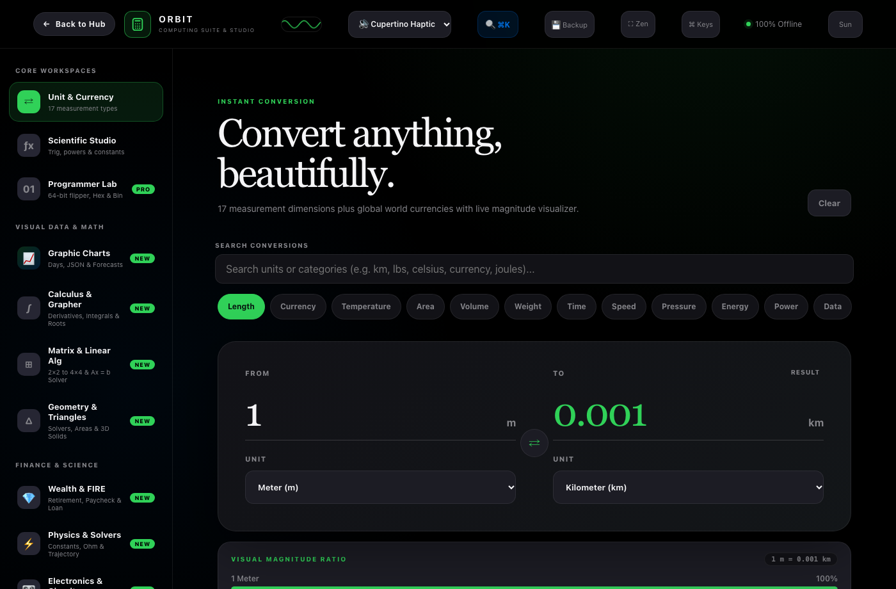
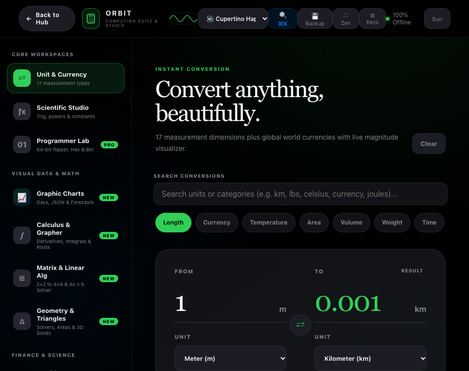

# 🧮 Orbit Universal Computing Suite & Graphic Studio -- User Guide

**Orbit Universal Computing Suite** is an Apple-grade multi-domain scientific calculation, unit conversion, visual data analytics, low-level bitwise manipulation, and engineering studio. Built natively for Bun RAD Studio, it combines 10+ specialized workspaces into a single zero-dependency, 100% offline desktop application with Web Audio sound synthesis, keyboard shortcuts, and interactive canvas graphics.

---

## ⚡ Quick Start

### Launch Desktop Application
```bash
bun run app:calculator
# or shorthand
bun run app:calc
```

### Launch Headless Web Server
```bash
bun run applications/calculator_studio.ts --server
```

### Terminal CLI Math Evaluator
```bash
bun run cli:calculator -e "sin(pi / 2) + sqrt(144)"
# or direct expression
bun run cli:calculator "12 * (45 - 18) / 3"
```

---

## 🖼️ Application Previews

| High-Resolution Desktop (1400×920) | Responsive Viewport (960×760) |
| :---: | :---: |
|  |  |

---

## 🖥️ Workspaces & Core Capabilities

### 1. ⇄ Unit & Currency Converter
- **17 Physical Dimensions**: Length, Currency, Temperature, Area, Volume, Weight/Mass, Time, Speed, Pressure, Energy, Power, Data Storage, Character/ASCII, Angles, Frequency, Force, Torque, and Fuel Economy.
- **Visual Magnitude Ratio Bar**: Dynamic proportional progress bar showing the relative scale between source and target units in real time.
- **Formula Guide Panel**: Exact mathematical formula explanation and conversion equation.
- **Reference Table**: Instant multi-unit comparison grid across popular units in the same dimension.
- **Touch Number Pad**: On-screen tactile numpad with sign toggle, backspace, and clipboard copy buttons.

### 2. ƒx Scientific Calculator Studio
- **Expression Engine**: Supports parentheses, unary negation, trigonometric functions (`sin`, `cos`, `tan`), logarithmic functions (`ln`, `log`), roots (`sqrt`), and powers (`^`).
- **Angle Modes**: One-click toggle between `DEG` (Degrees) and `RAD` (Radians).
- **Apple Memory Registers**: Dedicated `mc` (Memory Clear), `m+` (Add), `m−` (Subtract), and `mr` (Recall) registers with live memory status badge.
- **Physical Constants Bar**: One-click insertion chips for fundamental physical constants ($\pi$, $e$, $c$, $h$, $G$, $k_B$, $N_A$, $g$).

### 3. 01 Programmer & Bitwise Laboratory
- **64-bit Interactive Bit-Flipper**: Individual clickable bit matrix with byte groupings (63..0) and tactile sound feedback.
- **Synchronous Multi-Radix Card**: Live simultaneous display and bidirectional editing across `HEX`, `DEC`, `OCT`, `BIN`, and `CHAR`.
- **ALU Diagnostics**: Population count (Hamming weight / set bits), Leading Zeros count (CLZ), Trailing Zeros count (CTZ), Power-of-2 detection, parity check, and signed two's/one's complement.
- **IEEE-754 Floating Point Dissector**: Visual bit breakdown of Float32 and Float64 into Sign, Biased Exponent, and Normalized/Subnormal Mantissa fractions.
- **IPv4 & Subnet Inspector**: Dotted quad IP address breakdown, interactive CIDR prefix slider (`/0` to `/32`), subnet mask, network ID, broadcast address, and host range.
- **Color & Checksums**: RGBA channel breakdown with CSS color preview, hardware-accelerated CRC-32 and Adler-32 checksum generation.
- **Multi-Language Codegen**: Instant code snippet generation for V (Vlang), C/C++, Rust, Go, Python, TypeScript, x86_64 Assembly, and Verilog.

### 4. 📈 Graphic Charts & Time-Series Studio
- **Visualization Modes**: Area Spline (Apple Health / Stocks style gradient fill), Pill Bar Chart, Activity Ring, and Stepped Cumulative views.
- **Curated Color Palettes**: Apple Mint (`#30d158`), Electric Blue (`#0071e3`), Fitness Orange (`#ff9f0a`), and Siri Purple (`#bf5af2`).
- **Data Science Overlays**: 7-day Exponential Moving Average (EMA) and linear trendline projection.
- **Statistical Regression Models**: Linear ($y = mx + b$), Exponential ($y = a \cdot e^{bx}$), and 2nd-degree Polynomial ($y = ax^2 + bx + c$) curves with live $R^2$ goodness-of-fit indicator.
- **Interactive Scrubber Tooltip**: Floating glass tooltip showing daily values, percentage deltas vs. previous day, and deviations from dataset average.
- **Bento Metrics Grid**: 6-card metrics summary (Daily Average, Total Sum, Peak Day, Lowest Day, Momentum, Standard Deviation).
- **Data Studio Table & JSON**: Editable spreadsheet-like table and raw JSON dataset import/export with format validation.

### 5. ∫ Calculus & Multi-Mode Grapher
- **Multi-Mode Coordinate Systems**:
  - **Cartesian $f(x)$**: Plots custom functions, analyzes derivatives, and calculates roots.
  - **Dual $f(x)$ & $g(x)$**: Plots two curves simultaneously and numerically detects intersection points.
  - **Polar $r(\theta)$**: Plots cardioids, multi-leaf roses, and Archimedean spirals.
  - **Parametric $[x(t), y(t)]$**: Plots Lissajous curves, astroids, and harmonic trajectories.
- **Definite Integral ($\int_a^b f(x)dx$)**: Shaded area visualizer powered by Simpson's 1/3 rule.
- **Numerical Derivative ($f'(x_0)$)**: Calculates tangent slope and plots the tangent line with contact bead.
- **Newton-Raphson Root Solver**: Iterative root finder with extrema detection.

### 6. ⊞ Matrix & Linear Algebra Laboratory
- **Configurable Dimensions**: Toggle between $2 \times 2$, $3 \times 3$, and $4 \times 4$ matrices.
- **Matrix Operations**: Matrix addition ($A + B$), subtraction ($A - B$), multiplication ($A \times B$), transpose ($A^T$), determinant ($\det(A)$), inverse ($A^{-1}$), and trace ($\text{Tr}(A)$).
- **Linear Systems Solver ($A \cdot x = b$)**: Gaussian elimination with partial pivoting and back-substitution to solve for vector $x$.

### 7. △ Geometry & Triangles Studio
- **Triangle Solver**: Solves triangles by 3 Sides (SSS), 2 Sides + Angle (SAS), or 2 Angles + Side (ASA).
- **Dynamic Canvas Rendering**: Draws the triangle to scale with angle arcs, side measurement pill badges, vertex indicators, and inscribed circle (incircle).
- **Circle & Arc Solver**: Arc length, chord, sagitta, sector area, and segment area.
- **3D Solids Geometry**: Volume, surface area, and lateral area for spheres, cylinders, cones, toruses, and rectangular prisms.

### 8. 💎 Wealth & FIRE Planner
- **Retirement Nest Egg Trajectory**: Projections with customizable current savings, monthly savings, expected return, and annual spending.
- **4% Rule FIRE Target**: Calculates the exact age at which financial independence is achieved.
- **Salary & Paycheck Donut**: Interactive breakdown of gross salary across federal tax, state tax, FICA, pre-tax 401(k), and net take-home pay.
- **US Inflation Time Machine (1913–2026)**: Historical US Consumer Price Index (CPI) purchasing power calculator with cumulative inflation and annualized rates.
- **Dividend Reinvestment (DRIP) Visualizer**: Models portfolio growth with reinvested dividends, dividend growth rate, and capital appreciation.

### 9. ⚡ Physics & Engineering Solvers
- **Universal Physical Constants Table**: Searchable reference table with one-click clipboard copy and direct insertion into the Scientific Calculator.
- **Kinematic Projectile Motion**: Trajectory simulator with launch velocity, launch angle, and initial height, displaying flight time, range, and peak altitude.
- **Ohm's Law & Power**: Instant resistance ($R = V/I$) and electrical power ($P = V \cdot I$) calculations.
- **Relativistic Time Dilation**: Calculates the Lorentz factor ($\gamma$) and dilated time at fractions of the speed of light ($v/c$).

### 10. 🎛️ Electronics & Circuits Studio
- **Resistor Color Code Decoder**: Supports 4-band and 5-band resistors, drawing a realistic ceramic resistor with color bands, specular highlights, and metal leads on canvas.
- **LC Resonance & RC Filters**: Calculates resonant frequency ($f_0$), period, characteristic impedance ($Z_0$), and RC cutoff frequency ($f_c$).
- **SMD Resistor Decoder & Voltage Divider**: Decodes 3-digit, 4-digit, and EIA-96 SMD resistor markings, and calculates dual-resistor voltage divider outputs.

### 11. ◎ Smart Everyday Utilities
- **BMI Calculator**: Interactive color-banded gauge with pointer position.
- **Precise Date Difference**: Days, calendar breakdown (years, months, days), weeks, and business days.
- **GPA Calculator**: Weighted GPA calculator supporting both letter grades (A, B+, C) and 4.0 numerical scales with graduation honors.
- **Data Statistics**: Mean, median, standard deviation, interquartile range (IQR), histogram, and box-and-whisker plot.
- **Color Science & WCAG Contrast**: Real-time foreground/background contrast ratio check against WCAG 2.1 AA/AAA guidelines, with RGB, HSL, and CMYK conversions.
- **Financial Calculators**: Percentage 3-in-1, Tip Splitter, Discount + Sales Tax, and Return on Investment (ROI).

### 12. ↺ Paper Tape Journal
- **Audit Roll**: Continuous history record of every calculation, conversion, and evaluation.
- **Notes & Annotations**: Add custom tags and notes to history cards.
- **Export**: One-click TXT receipt export and individual result copying.

---

## 🔍 Spotlight Omni Command Palette (⌘K or /)

Press `⌘K` or `/` anywhere in the application to open the Spotlight-style command palette:
- **Instant Math**: Type calculations like `45 * 12 + sqrt(144)` to evaluate them immediately without leaving your workspace.
- **Quick Navigation**: Search and jump directly to any of the 12 workspaces.
- **Physical Constants**: Search and insert constants directly into the Scientific Studio.
- **Theme & Zen Controls**: Toggle Zen Mode and dark/light themes instantly.

---

## 🔊 Web Audio Synthesis Engine

Choose from 4 synthesizer audio feedback profiles in the top bar:
1. **Cupertino Haptic**: Crisp, modern Apple haptic click (sine wave with exponential pitch drop).
2. **Mechanical Thock**: Cherry MX style tactile mechanical keyboard switch click + thock.
3. **Retro Synth**: Vintage arcade frequency chirp.
4. **Sound Off**: Completely silent operation.

The header includes a real-time oscilloscope canvas visualizer that reacts to user interactions.

---

## ⌨️ Global Keyboard Shortcuts

| Shortcut | Action |
| :--- | :--- |
| `⌘K` or `/` | Open Spotlight Omni Command Palette |
| `⌘F` | Toggle Native Fullscreen |
| `⌘Q` / `⌘W` | Quit / Close Window |
| `?` | Toggle Keyboard Shortcuts Modal |
| `Esc` | Clear calculation / Exit Zen Mode / Close Modals |
| `0`–`9`, `.` | Input numbers |
| `+`, `−`, `*`, `/`, `^` | Math operators |
| `Enter` or `=` | Solve expression / apply operator |
| `Backspace` | Delete last character |
