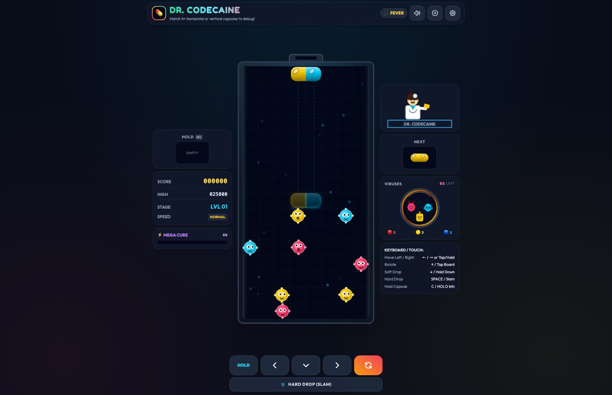
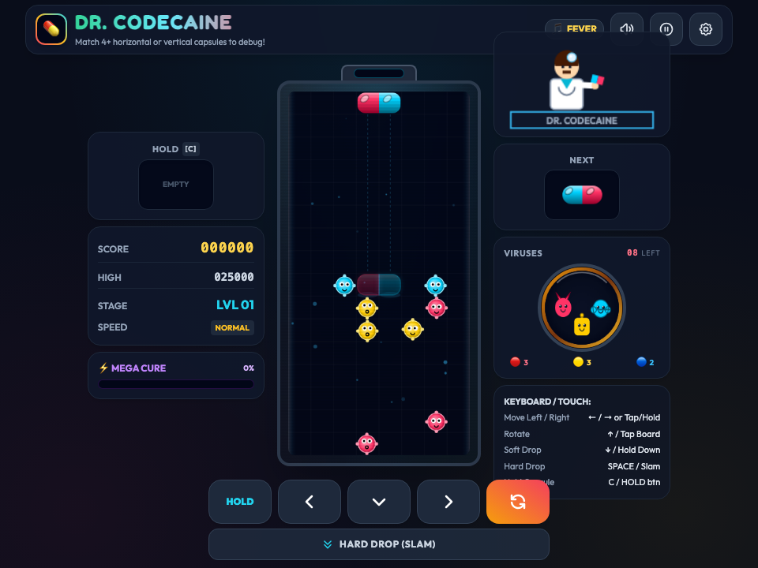

# 💊 Dr. Codecaine Arcade -- User Guide

**Dr. Codecaine Arcade** is a fast-paced, tactile capsule-matching puzzle arcade experience built natively for Bun RAD Studio. Combining nostalgic color-matching puzzle mechanics with procedural viral pathogens, retro audio synthesis, high-DPI scaling, and responsive desktop windowing, Dr. Codecaine Arcade brings pure arcade energy directly to your desktop workstation.

---

## ⚡ Quick Start

### Launch Desktop Application
```bash
bun run app:dr_codecaine
```

### Launch Headless Web Server
```bash
bun run applications/dr_codecaine_studio.ts --server
```

---

## 🖼️ Application Previews

| High-Resolution Desktop (1280×850) | Responsive Viewport (960×720) |
| :---: | :---: |
|  |  |

---

## 🕹️ Gameplay & Core Mechanics

### 1. Dual-Tone Capsule Matching
- **Objective**: Clear all viruses in the jar by aligning 4 or more matching color segments (capsules and viruses) horizontally or vertically.
- **Tricolor Palette**: Red (Fever), Yellow (Jaundice), and Blue (Chills) pathogens and capsule segments.
- **Gravity & Cascade Chaining**: When a match dissolves, floating half-capsules drop under gravity, triggering chain reactions and massive score multipliers.

### 2. Difficulty & Speed Scaling
- **Speed Settings**:
  - `LOW`: Casual pacing, ideal for warm-up and calculated chain setups.
  - `MED`: Standard arcade speed, rapid reflexes required.
  - `HI`: Extreme drop speed for high-score competitive runs.
- **Virus Count Progression**: Level selection allows scaling virus count from 1 up to 20 per stage.

### 3. Audio & Synthesis Engine
- **Synthesized Sound Effects**: Built with HTML5 Web Audio API, generating retro 8-bit square wave chiptunes, drop clicks, rotation blips, and victory arpeggios with zero external sound asset dependencies.
- **Sound Toggle**: Instant mute/unmute audio button with persistent player preference.

---

## ⌨️ Desktop Keyboard & Gamepad Controls

| Action | Primary Key | Secondary Key |
| :--- | :--- | :--- |
| **Move Left** | `←` Left Arrow | `A` |
| **Move Right** | `→` Right Arrow | `D` |
| **Soft Drop (Faster)** | `↓` Down Arrow | `S` |
| **Hard Drop (Instant)** | `Space` | `Enter` |
| **Rotate Clockwise** | `↑` Up Arrow | `W` / `X` |
| **Rotate Counter-Clockwise** | `Z` | `Shift` |
| **Pause / Resume** | `P` | `Escape` |
| **Restart Level** | `R` | — |
| **Toggle Fullscreen** | `F` | `F11` |

---

## 🛠️ Architecture & Offline Design

- **Zero External Dependencies**: Pure HTML5 Canvas, Vanilla CSS3, and JavaScript logic packaged inside a native desktop WKWebView.
- **Instant Launch**: Starts in sub-100ms via Bun's native runtime.
- **High-DPI Retina Ready**: Automatic pixel-ratio canvas scaling prevents blurriness on Retina 4K/5K displays.
