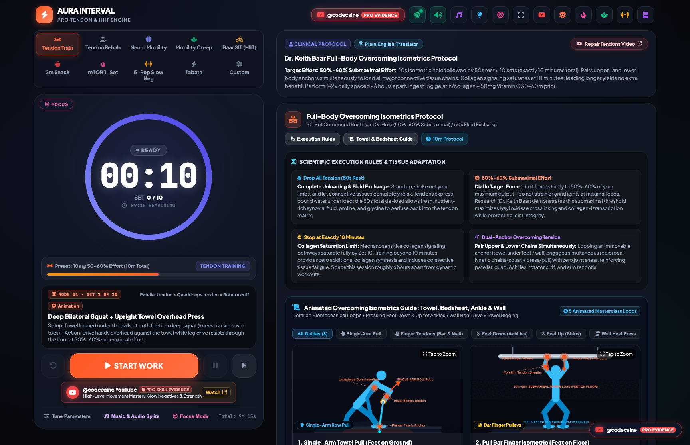
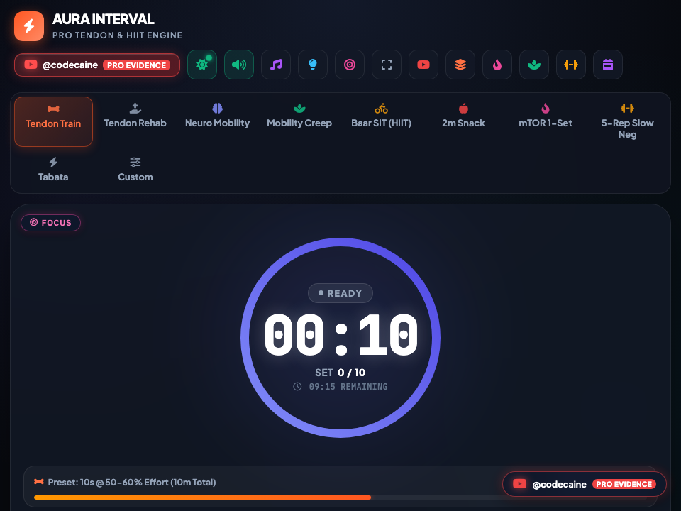

# ⏱️ Interval Timer & High-Performance Calisthenics Suite -- User Guide

**Interval Timer & High-Performance Calisthenics Suite** is a dedicated athletic conditioning, isometric tendon training, and high-intensity interval workstation. Built for high-performance longevity, mobility protocols, and joint-sparing strength progression, it packages research-backed isometric tendon protocols (Keith Baar), animated exercise guides, periodized weekly matrices, and audio cue synthesis into a zero-latency native desktop environment.

---

## ⚡ Quick Start

### Launch Desktop Application
```bash
bun run app:interval_timer
```

### Launch Headless Web Server
```bash
bun run applications/interval_timer_studio.ts --server
```

---

## 🖼️ Application Previews

| High-Resolution Desktop (1380×920) | Responsive Viewport (960×720) |
| :---: | :---: |
|  |  |

---

## 🏋️ Workspaces & Core Capabilities

### 1. High-Precision Interval Engine
- **Customizable Intervals**: Precise configuration for Work time, Rest time, Preparation countdown, Cycles per set, Sets count, and Inter-set rest recovery.
- **High-Contrast Digital HUD**: Large viewport timer display readable from across the training area, with phase-coded color indicators (Green for Work, Amber for Rest, Blue for Cooldown).
- **Tone.js Sound Synthesis**: Multi-frequency audio cues for 3-2-1 countdowns, work start chimes, and rest signals that cut through background music.

### 2. Keith Baar Isometric Tendon Training Protocols
- **Isometric Overload Protocols**: Joint-friendly collagen synthesis routines specifically designed for patellar tendons, Achilles tendons, distal biceps, and rotator cuffs.
- **Embedded Demonstration Guides**: 20 animated high-resolution GIFs and diagrams embedded offline as Base64 Data URIs, showing exact joint angles, tension lines, and hold execution without network lag.
- **Protocol Presets**:
  - `AM: Tendon Isometrics`: Heavy slow resistance & long-duration isometric holds for tendon stiffness.
  - `Pre-Workout: Neuro Mobility`: Active dynamic warmup and motor-unit recruitment.
  - `AM: Mobility Creep`: End-range active flexibility and joint capsule decompression.
  - `Midday: 2m Snack`: Fast desk decompression breaks targeting thoracic spine and hip flexors.
  - `PM: mTOR 1-Set`: High-tension single-set hypertrophy stimulus.

### 3. Routine Companion & Workout Music Links
- **Direct YouTube Playlist Bridge**: Direct single-click launcher to @codecaine's original 24-album workout soundtrack collection on YouTube (25+ hours of ad-free training music).
- **Native OS Link Routing**: All external YouTube exercise references and video links open cleanly in your default system browser (Safari/Chrome) via Bun's native bridge.

### 4. 7-Day Periodization Matrix
- **Weekly Schedule Tracking**: Structured weekly training matrix designed for master calisthenic athletes (Age 45+), balancing maximal isometric strain, tendon remodeling cycles, active recovery, and neural restoration.

---

## ⌨️ Desktop Keyboard Shortcuts

| Key | Action |
| :--- | :--- |
| `Space` | Start / Pause Timer |
| `R` | Reset Routine to Initial State |
| `N` | Skip to Next Interval / Cycle |
| `P` | Return to Previous Interval |
| `M` | Toggle Audio Beeps & Sound Engine |
| `F` | Focus Mode (Maximizes Timer Display & Minimizes Distractions) |
| `Esc` | Exit Focus Mode / Reset View |
| `Alt` + `Alt` | Quick Window Close |

---

## 🛠️ Offline Architecture

- **100% Self-Contained**: All animation assets and diagrams are pre-compiled into Base64 strings on launch, enabling seamless offline training sessions in gyms, outdoors, or planes.
