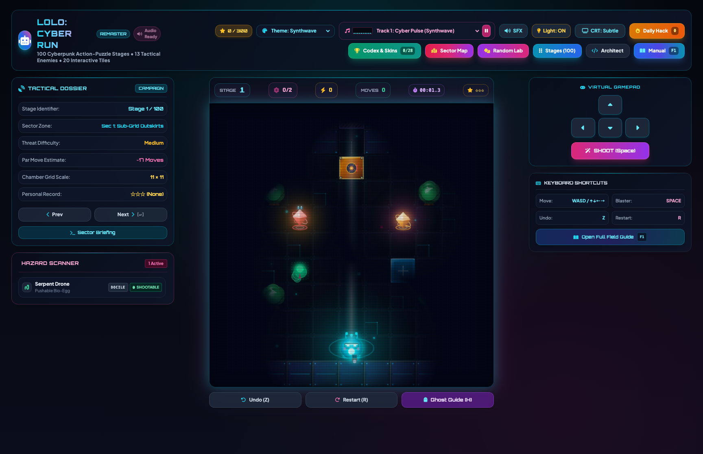
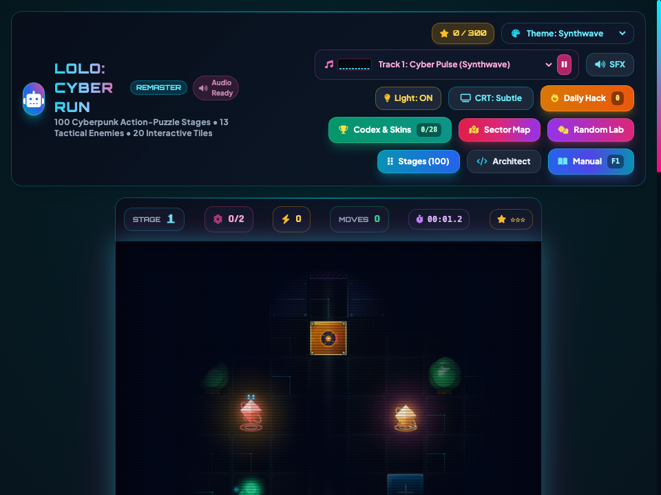

# 🏰 Adventures of Lolo Remaster -- User Guide

**Adventures of Lolo Remaster** is a modern cyberpunk desktop reimagining of the iconic HAL Laboratory NES puzzle classic. Featuring high-definition procedural puzzle chambers, emerald heart collection, obstacle block physics, enemy AI states (Snakey, Gol, Skull, Alma, Medusa, Don Medusa), synthesized 8-bit sound effects, and an interactive in-game instruction manual, this workstation delivers timeless brain-teasing puzzle mechanics to Bun RAD Studio.

---

## ⚡ Quick Start

### Launch Desktop Application
```bash
bun run app:lolo
```

### Launch Headless Web Server
```bash
bun run applications/lolo_studio.ts --server
```

---

## 🖼️ Application Previews

| High-Resolution Desktop (1280×850) | Responsive Viewport (960×720) |
| :---: | :---: |
|  |  |

---

## 🧩 Gameplay Mechanics & Objectives

### 1. The Core Puzzle Loop
- **Heart Framer Collection**: Lolo must traverse each room and collect every Heart Framer scattered across the floor grid.
- **Chest Unlock**: Collecting the final Heart Framer unlocks the Great Jewel Chest.
- **Room Exit**: Grabbing the jewel banishes or neutralizes remaining monsters and opens the chamber door to advance to the next level.

### 2. Magic Shots & Monster Manipulation
- **Magic Shots**: Certain Heart Framers award Magic Shots (displayed in the top HUD).
- **Egg Encapsulation**: Shooting an enemy with a magic shot encases it in an egg for several seconds.
- **Egg Pushing & Rafting**: Lolo can push egg-encased enemies into rivers to use as temporary rafts or block deadly line-of-sight attacks (such as Medusa gaze).
- **Secondary Shot (Banishment)**: Shooting an already-encased egg blasts it off the board. It will respawn in its original position after a cooldown.

### 3. Obstacles & Hazards
- **Emerald Framers (Blocks)**: Movable green blocks that can be pushed (not pulled) to construct barriers, redirect enemy pathways, or shield against Medusa line of sight.
- **One-Way Arrows**: Directional tiles that can only be crossed in the indicated arrow direction.
- **Lava & Water Tiles**: Lethal environmental hazards that require rafts or bridges to cross safely.

### 4. Enemy AI Rogues Gallery
- **Snakey**: Passive green serpents that serve as harmless obstacles and convenient movable eggs.
- **Gol**: Dormant fire-breathing dragons that awaken and shoot fireballs once all hearts are collected.
- **Skull**: Fast-charging skeletal monsters that awaken and pursue Lolo once all hearts are gathered.
- **Alma**: Aggressive red armadillos that patrol the chamber and curl into bowling balls upon spotting Lolo.
- **Medusa**: Immobile stone gorgons that instantly kill Lolo if he crosses their unbroken vertical or horizontal line of sight.
- **Don Medusa**: Patrolling sword-wielding gorgons that sweep along corridors with instant-kill line of sight.

---

## ⌨️ Desktop Keyboard & Gamepad Controls

| Action | Primary Key | Secondary Key |
| :--- | :--- | :--- |
| **Move Up** | `↑` Up Arrow | `W` |
| **Move Down** | `↓` Down Arrow | `S` |
| **Move Left** | `←` Left Arrow | `A` |
| **Move Right** | `→` Right Arrow | `D` |
| **Magic Shot** | `Space` | `Z` / `J` |
| **Suicide / Restart Chamber** | `K` | `R` |
| **Open Integrated Manual** | `M` | `H` |
| **Toggle Sound FX** | `U` | — |
| **Toggle Fullscreen** | `F` | `F11` |

---

## 📖 Integrated Game Manual

Adventures of Lolo Remaster features an integrated offline instruction booklet accessible via the **Manual** button in the header or by pressing `M`. The manual details:
- Complete monster compendium and behavioral attack patterns.
- Heart framer and magic shot mechanics.
- River crossing and rafting techniques.
- Medusa line-of-sight defense strategies.
