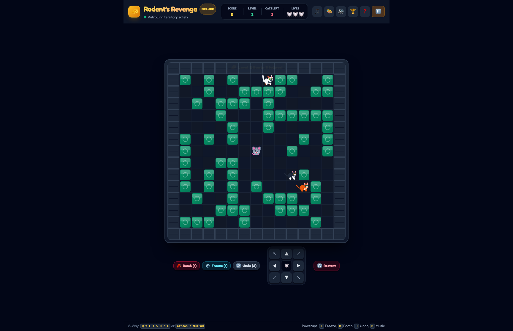
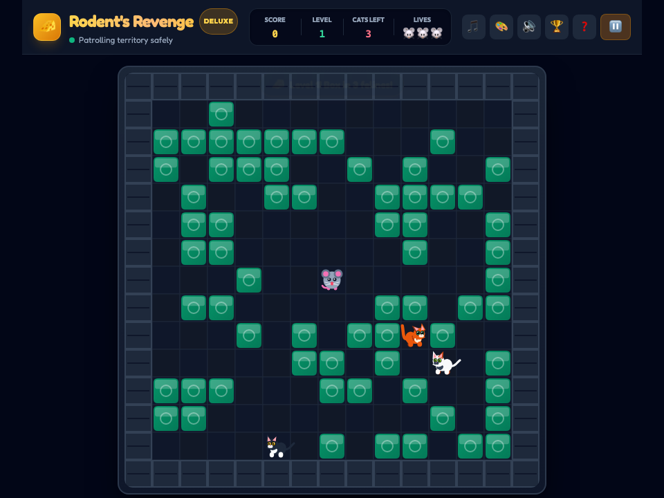

# 🐭 Rodent's Revenge Deluxe -- User Guide

**Rodent's Revenge Deluxe** is a high-definition desktop remaster of the classic 1991 Microsoft Entertainment Pack puzzle arcade game. Controlling a clever mouse trapped inside a treacherous neon grid, players must strategically push movable cheese and metal blocks to trap hostile feline predators, converting them into succulent cheese wedges while dodging mouse traps, sinkholes, and yarn balls.

---

## ⚡ Quick Start

### Launch Desktop Application
```bash
bun run app:rodents_revenge
```

### Launch Headless Web Server
```bash
bun run applications/rodents_revenge_studio.ts --server
```

---

## 🖼️ Application Previews

| High-Resolution Desktop (1280×850) | Responsive Viewport (960×720) |
| :---: | :---: |
|  |  |

---

## 🕹️ Strategy & Gameplay Rules

### 1. The Cat Trapping Loop
- **Objective**: Eliminate all predatory cats from the level grid to clear the stage.
- **Trap Mechanism**: Cats move toward the mouse using heuristic pathfinding. When a cat has zero valid adjacent tiles to step on (completely surrounded by blocks, walls, or other cats), it is neutralized and turns into a cheese wedge.
- **Cheese Collection**: Walking over trapped cheese awards bonus score multipliers and resets the survival clock.

### 2. Block Manipulation & Movement
- **Pushing Blocks**: The mouse can push movable blocks one tile at a time.
- **Unpushable Barriers**: Immovable perimeter walls and heavy stationary stone blocks form defensive anchors for tactical trapping.
- **Block Clusters**: Pushing multiple connected blocks simultaneously is not permitted—planning corridors and escape routes is paramount.

### 3. Hazards & Power-Ups
- **Mouse Traps**: Deadly mechanical spring traps hidden across the floor that trigger instant death if stepped on.
- **Sinkholes**: Collapsible floor tiles that swallow blocks or rodents.
- **Yarn Balls**: Bouncing kinetic hazards that ricochet off walls unpredictably.

---

## ⌨️ Desktop Keyboard & Navigation

| Key | Direction / Action |
| :--- | :--- |
| `↑` / `W` | Move Up |
| `↓` / `S` | Move Down |
| `←` / `A` | Move Left |
| `→` / `D` | Move Right |
| `Space` | Pause / Resume Game |
| `R` | Restart Current Level |
| `F` | Toggle Fullscreen Mode |
| `Alt` + `Alt` | Quick Window Close |

---

## 🛠️ Performance & Display Features

- **Hi-DPI Canvas Rendering**: Crisp, vector-sharp graphics with retro cyberpunk scanlines and neon color accents.
- **Instant Restarts**: Zero load-time restarts and level transitions.
- **Synthesized Audio**: Dynamic frequency clicks, cheese chimes, and cat trap fanfares generated via HTML5 Web Audio API.
