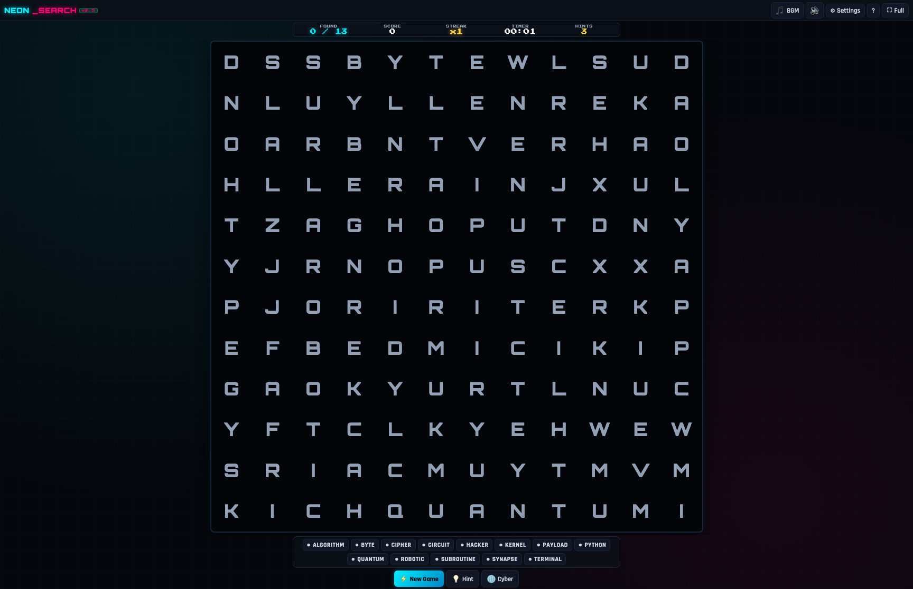
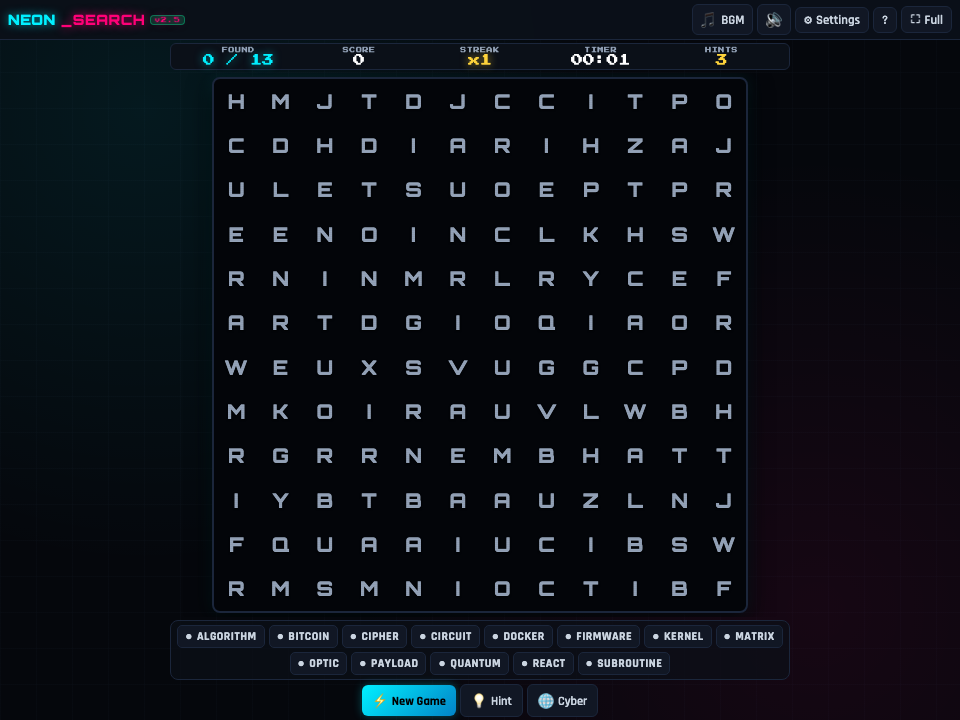

# 🔠 Neon Word Search Labyrinth -- User Guide

**Neon Word Search Labyrinth** is a AAA cyberpunk word discovery puzzle game built for Bun RAD Studio. Featuring procedural dictionary matrix generation across 8 distinct thematic categories, particle celebration bursts, ambient synthesizer soundscapes, interactive drag-and-click selection vectors, and progressive difficulty ladders, it brings modern arcade polish to classic vocabulary puzzles.

---

## ⚡ Quick Start

### Launch Desktop Application
```bash
bun run app:word_search
```

### Launch Headless Web Server
```bash
bun run applications/word_search_studio.ts --server
```

---

## 🖼️ Application Previews

| High-Resolution Desktop (1280×850) | Responsive Viewport (960×720) |
| :---: | :---: |
|  |  |

---

## 🧩 Features & Puzzle Mechanics

### 1. Multi-Vector Word Matching
- **Directional Vectors**: Words can be formed in 8 directions:
  - Horizontal (Left-to-Right and Right-to-Left / Reverse)
  - Vertical (Top-to-Bottom and Bottom-to-Top)
  - Diagonal (All four diagonal quadrant angles)
- **Fluid Path Highlighting**: Click or drag across the starting letter to the ending letter. A glowing neon capsule tracer locks onto valid word paths automatically.

### 2. Thematic Word Dictionaries
Select from 8 specialized topic banks:
- `💻 Computer Science & Coding`: Algorithms, compilers, tokens, threads, memory, architectures.
- `⚡ Electronics & Hardware`: Semiconductors, capacitors, microcontrollers, logic gates.
- `🌌 Astronomy & Cosmos`: Nebulae, pulsars, exoplanets, gravitational waves.
- `🧪 Chemistry & Elements`: Isotopes, covalent bonds, catalyst reactions, polymers.
- `🧬 Biology & Genetics`: Ribosomes, nucleotide sequences, enzymes, cellular biology.
- `🏛️ Philosophy & Stoicism`: Epictetus, logic, virtue, dialectic, sovereign autonomy.
- `🌍 Global Geography`: Continental shelves, archipelagos, tectonic rifts, coordinates.
- `🎮 Arcade Classics`: Shmups, coin-ops, high scores, scanlines, joysticks.

### 3. Audio & Visual Synthesis
- **Web Audio Sound Effects**: Subtle harmonic chimes on valid word discovery, chord progressions on puzzle completion, and click feedback on letter selection.
- **Neon Particle Canvas**: Colorful particle explosions burst outward from found words, rewarding sharp pattern recognition.

---

## ⌨️ Desktop Controls & Shortcuts

| Action | Control |
| :--- | :--- |
| **Select Word** | Click first letter, drag and release on last letter |
| **Hint (Reveal Letter)** | `H` or click the **Hint** button |
| **New Puzzle / Regenerate** | `N` or click the **New Grid** button |
| **Category Switch** | Click any Category pill in the sidebar |
| **Toggle Sound** | `M` (Mute / Unmute) |
| **Toggle Fullscreen** | `F` |

---

## 🛠️ Offline Architecture

- **Zero API Calls**: Procedural word placement and collision algorithms run entirely in memory using local static dictionaries.
