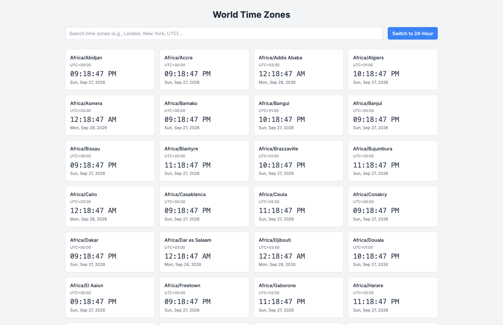
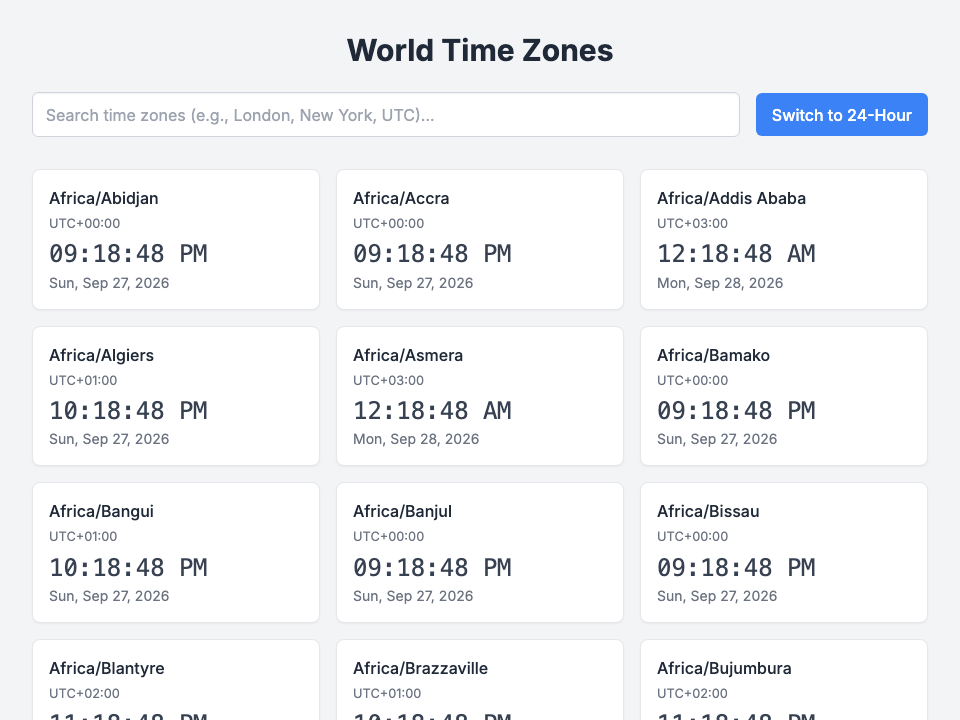

# 🌐 World Time Zones Studio Pro -- User Guide

**World Time Zones Studio Pro** is an executive-grade international time synchronization, global meeting planner, and UTC offset observatory designed for distributed teams and global operations. Featuring real-time analog and digital clocks, instant city/country fuzzy search, interactive slider-based time travel simulation, solar day/night indicators, and custom timezone pinning, World Time Zones Studio Pro keeps international coordination effortless and precise.

---

## ⚡ Quick Start

### Launch Desktop Application
```bash
bun run app:world_time_zones
```

### Launch Headless Web Server
```bash
bun run applications/world_time_zones_studio.ts --server
```

---

## 🖼️ Application Previews

| High-Resolution Desktop (1280×850) | Responsive Viewport (960×720) |
| :---: | :---: |
|  |  |

---

## 🕒 Features & Workstation Capabilities

### 1. Global Time Observatory
- **Real-Time Synchronized Clocks**: Continuous sub-second precision digital and analog clocks across all major world financial capitals (New York, London, Tokyo, Paris, Sydney, Singapore, Zurich, Dubai, San Francisco, and more).
- **Day / Night Terminator Status**: Dynamic solar icons and visual brightness badges indicate daytime, dawn, dusk, or nighttime conditions in each remote region.
- **UTC / GMT Relative Offsets**: Immediate visual indicators displaying relative hour differences (e.g., `+5 hrs`, `-3 hrs`, `Same time`) against your current local workstation.

### 2. Time Slider & Meeting Planner Mode
- **Interactive Scrubber Slider**: Scrub back and forth across 24 hours to simulate future or past meeting windows. All pinned city cards update their local time synchronously.
- **Working Hours Highlight**: Green indicators spotlight standard business operating hours (9:00 AM – 5:00 PM local) across all target locations to identify optimal overlap slots for distributed engineering syncs.

### 3. City Search & Custom Board Pinning
- **Fuzzy Search**: Filter across 500+ global cities, timezones (EST, PST, CET, JST, UTC), and countries.
- **One-Click Pin / Unpin**: Pin favorite cities to your primary dashboard card grid.
- **Persistent Local State**: Pinned cities and customized time displays are saved locally across restarts.

---

## ⌨️ Desktop Keyboard Shortcuts

| Shortcut | Action |
| :--- | :--- |
| `/` or `Cmd` + `F` | Focus City Search Bar |
| `R` | Reset Time Slider to Current Live Time |
| `Space` | Pause / Resume Live Clock Ticking |
| `F` | Toggle Desktop Fullscreen |
| `Alt` + `Alt` | Quick Window Close |

---

## 🛠️ Offline Reliability

- **Pure Intl Primitives**: Utilizes native ECMAScript `Intl.DateTimeFormat` standards without bloated moment/date-fns dependencies or external network API calls. Works 100% offline.
