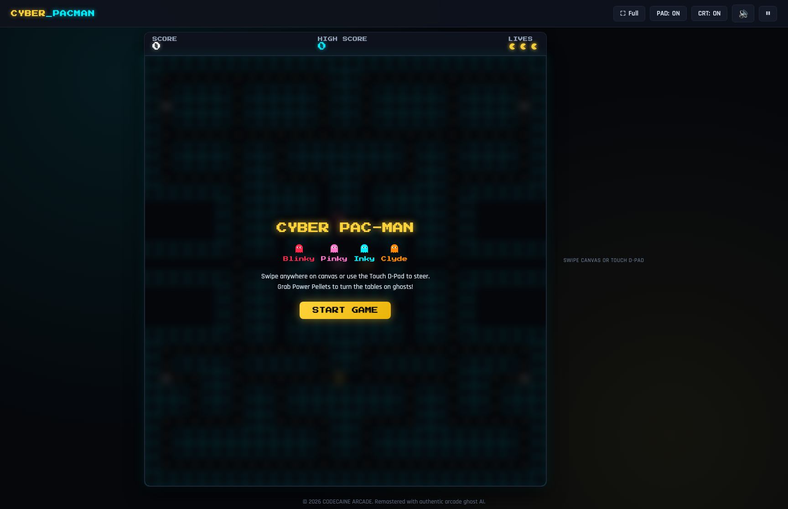
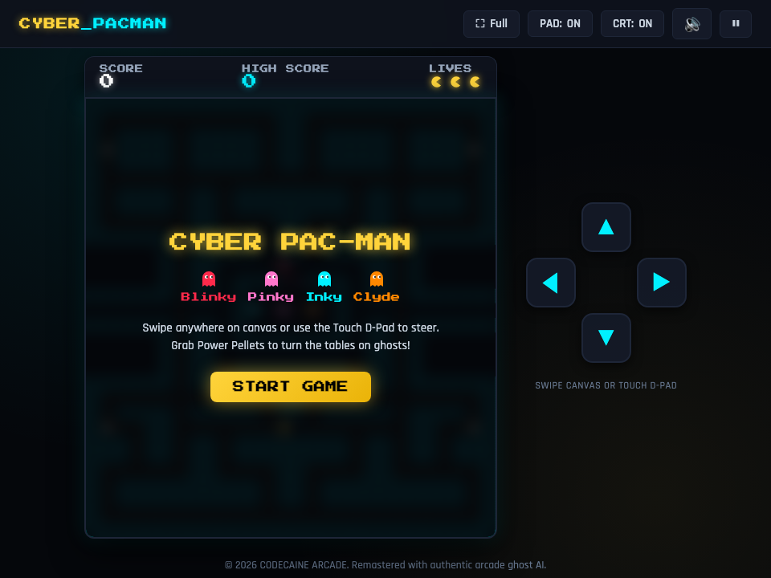

# 🕹️ Cyberpunk Pac-Man Arcade -- User Guide

**Cyberpunk Pac-Man Arcade** is a neon-infused arcade remaster of the legendary 1980 Namco classic. Built natively for Bun RAD Studio, it delivers the authentic maze navigation, 4-ghost AI personality algorithms (Blinky, Pinky, Inky, Clyde), energetic fruit bonus rounds, power pellet energizers, dynamic sound synthesis, and particle explosion visual effects in a sleek desktop package.

---

## ⚡ Quick Start

### Launch Desktop Application
```bash
bun run app:pacman
```

### Launch Headless Web Server
```bash
bun run applications/pacman_studio.ts --server
```

---

## 🖼️ Application Previews

| High-Resolution Desktop (1280×850) | Responsive Viewport (960×720) |
| :---: | :---: |
|  |  |

---

## 🎮 Ghost AI Personalities & Maze Mechanics

### 1. Authentic Ghost AI Algorithms
Each ghost runs its classic algorithmic targeting logic:
- **🔴 Blinky (Shadow - Red)**: Direct pursuit hunter. Targets Pac-Man's exact tile coordinates. Speeds up as remaining dots decrease ("Cruise Elroy").
- **🌸 Pinky (Speedy - Pink)**: Ambush predator. Targets 4 tiles ahead of Pac-Man's current facing vector to cut off escape routes.
- **🔷 Inky (Bashful - Cyan)**: Flanker. Computes a complex vector using both Blinky's location and the tile 2 spaces ahead of Pac-Man, creating lethal pincer traps.
- **🟠 Clyde (Pokey - Orange)**: Feigned cowardly. Pursues Pac-Man when farther than 8 tiles away, but retreats to his home scatter corner when closer.

### 2. Scatter, Chase, and Frightened Modes
- **Cycle Timers**: Ghosts oscillate between timed **Scatter** (retreating to perimeter corners) and **Chase** phases.
- **Power Pellets (Energizers)**: Eating an energizer in the four corners turns all ghosts blue into **Frightened Mode**. Pac-Man can chomp ghosts for exponential bonus points:
  - 1st Ghost: 200 pts
  - 2nd Ghost: 400 pts
  - 3rd Ghost: 800 pts
  - 4th Ghost: 1600 pts
- **Ghost Eyes Return**: Chomped ghosts revert to floating eyes that race back to the central monster pen to regenerate.

### 3. Bonus Fruits
- Scoring milestones trigger special bonus items beneath the ghost house (Cherries, Strawberries, Oranges, Apples, Melons, Galaxian Flagships, Bells, and Keys) awarding high-value points.

---

## ⌨️ Desktop Keyboard & Gamepad Controls

| Key | Direction / Action |
| :--- | :--- |
| `↑` / `W` | Move Up |
| `↓` / `S` | Move Down |
| `←` / `A` | Move Left |
| `→` / `D` | Move Right |
| `Space` | Start Game / Pause / Resume |
| `R` | Restart Game |
| `M` | Mute / Unmute Sound FX |
| `F` | Toggle Fullscreen Mode |
| `Alt` + `Alt` | Quick Window Close |

---

## 🛠️ Architecture & Sound Synthesis

- **Synthesized Retro Audio**: All classic siren wails, waka-waka chomp sweeps, frightened ghost warbles, and death melodies are synthesized in real-time via the Web Audio API. Zero external audio files required.
- **Fluid High-Refresh Canvas**: Supports 60fps / 120fps high-refresh rate displays with sub-pixel alignment and smooth cornering pre-turns.
